<h1 align="center">Calibrex</h1>

<p align="center">
  <strong>Evidence-first calibration for robotics sensors.</strong><br>
  Calibrate solid-state LiDAR and multi-sensor rigs with holdouts, observability, and provenance you can reproduce.
</p>

<p align="center">
  <a href="https://github.com/rsasaki0109/Calibrex/actions/workflows/ci.yml"></a>
  
  
  
  
  
</p>

Calibrex is an open-source, ROS-independent Python toolkit that turns candidate
extrinsics, time offsets, and trajectories into evidence backed by **holdout
metrics, known-bad controls, observability checks, and reproducible provenance**.

Use it when a transform must be more than a plausible number: evaluate native or
adapter-produced LiDAR, camera, IMU, radar, RGB-D, hand-eye, and robot-world
calibration without reducing the verdict to optimizer convergence or a single
training residual.

<p align="center">
  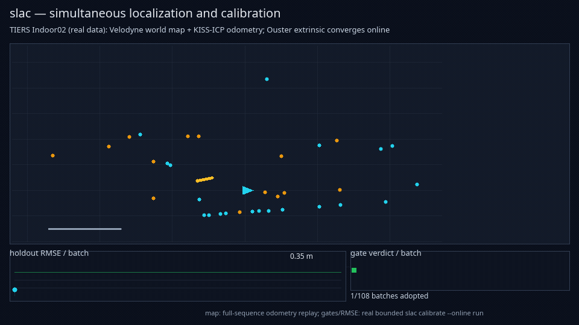
</p>

<p align="center">
  <sub>Real TIERS Indoor02 moving-platform replay: a Velodyne VLP-16 motion map
  supports online Ouster OS1 calibration, with 106 of 108 batches accepted by
  holdout gates.</sub>
</p>

<p align="center">
  <a href="https://rsasaki0109.github.io/Calibrex/"><strong>Documentation</strong></a>
  ·
  <a href="#five-minute-quickstart"><strong>Five-minute quickstart</strong></a>
  ·
  <a href="docs/concepts/calibration_methods.md"><strong>Calibration methods</strong></a>
  ·
  <a href="docs/tutorials/public_datasets.md"><strong>Public-data demos</strong></a>
</p>

## Five-minute quickstart

Render and validate a committed result without ROS or a dataset download:

```bash
git clone https://github.com/rsasaki0109/Calibrex.git
cd Calibrex
python -m pip install .

calibrex validate examples/precomputed/result.yaml --json
calibrex render examples/precomputed/result.yaml \
  --format evidence-card \
  --output outputs/quickstart/evidence-card.svg
calibrex render examples/precomputed/result.yaml \
  --output-dir outputs/quickstart
```

Open `outputs/quickstart/report.html`, then inspect or verify the
schema-valid sidecars. To recompute evidence from a declared public sample:

```bash
calibrex demo livox-evidence \
  --output-dir outputs/livox_horizon_horizon_pcd_sample
```

Before configuring a solve, diagnose a recording and save the result for
review or CI:

```bash
calibrex doctor recording.mcap \
  --output outputs/doctor.json \
  --json
calibrex validate outputs/doctor.json
```

`doctor` infers supported dataset types, reports missing optional dependencies,
data coverage and degeneracy warnings, and suggests compatible evidence
workflows. Running it without a path retains the lightweight environment check.

Run the same evidence gates on every calibration change:

```yaml
- uses: actions/checkout@v4
- uses: rsasaki0109/Calibrex@v0.4.0
  with:
    candidate: calibration/candidate.yaml
    baseline: calibration/baseline.yaml
```

The action writes a GitHub Step Summary, fails on `FAIL` or `INCONCLUSIVE` by
default, and exposes schema-valid evidence, comparison, SVG, and
`calibration-ci.json` artifacts. See [Calibration CI](docs/tutorials/calibration_ci.md).

## Calibration coverage

| Calibration path | Native solve | Evidence | Public example | Maturity |
|---|:---:|:---:|:---:|:---:|
| LiDAR ↔ LiDAR | ✅ | ✅ | ✅ | 🟢 Alpha |
| Camera ↔ LiDAR | ✅ | ✅ | ✅ | 🟡 Experimental |
| Hand-eye `AX=XB` | ✅ | ✅ | ✅ | 🟢 Alpha |
| Robot-world `AX=YB` | ✅ | ✅ | ✅ | 🟢 Alpha |
| LiDAR ↔ IMU | — | ✅ | ✅ | 🟡 Evidence |
| Radar extrinsic | ✅ | ✅ | ✅ | 🟡 Experimental |
| RGB-D joint SLAC | ✅ | ✅ | ✅ | 🟡 Experimental |
| Open3D / external tools | Adapter | ✅ | ✅ | 🔵 Adapter |

<p align="center">
  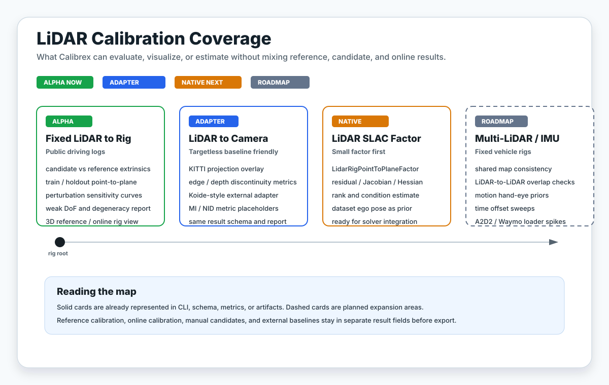
</p>

## Public real-data benchmarks

Calibrex evaluates all 13 native hand-eye methods and seven OpenCV 4 variants
on the [ETHZ ASL real robot-arm dataset](https://projects.asl.ethz.ch/datasets/hand-eye-calibration-2017/).
Every method sees the same five digest-locked absolute-pose splits. `AX=XB` and
`AX=YB` are separate equation families and are never ranked together.

### Hand-eye `AX=XB`

<!-- calibrex-benchmark:ethz-real-hand-eye-ax-xb-multiseed-2026-07-28:start -->
| Method | Holdout rotation RMSE deg ↓ | Holdout translation RMSE mm ↓ | Failure rate | Runtime s |
|---|---:|---:|---:|---:|
| Calibrex Park-Martin | 0.867227 [0.759962, 0.958155] | 13.8759 [11.7678, 15.8266] | 0.0% | 0.153451 |
| Calibrex Tsai-Lenz | 0.875291 [0.77004, 0.967317] | 13.8652 [11.7326, 15.8293] | 0.0% | 0.126921 |
| Calibrex Daniilidis | 0.868969 [0.761845, 0.960775] | **13.8212 [11.9121, 15.6887]** | 0.0% | 0.322403 |
| Calibrex Andreff | **0.867199 [0.759958, 0.958223]** | 13.879 [11.7674, 15.8309] | 0.0% | 0.334728 |
| Calibrex Shiu-Ahmad | 1.6191 [0.787831, 3.10277] | 31.9219 [12.7334, 52.761] | 0.0% | 14.1537 |
| Calibrex Chou-Kamel | 0.867205 [0.759953, 0.958241] | 13.8795 [11.7684, 15.8315] | 0.0% | 0.129661 |
| Calibrex Horaud-Dornaika | 0.890804 [0.782116, 0.996268] | 14.1434 [11.8641, 16.1088] | 0.0% | 0.139859 |
| Calibrex H-D nonlinear | 0.885789 [0.777979, 0.991045] | 14.0634 [11.8408, 16.0027] | 0.0% | 19.4512 |
| OpenCV Tsai | 0.871872 [0.769051, 0.961725] | 13.8681 [11.8255, 15.6992] | 0.0% | 0.0368567 |
| OpenCV Park | 0.867225 [0.759969, 0.958144] | 13.8754 [11.7667, 15.8261] | 0.0% | 0.0280751 |
| OpenCV Horaud | 0.867203 [0.759961, 0.958229] | 13.879 [11.7674, 15.831] | 0.0% | 0.0248639 |
| OpenCV Andreff | 0.868623 [0.763653, 0.959819] | 15.4855 [13.6068, 17.338] | 0.0% | 0.0327896 |
| OpenCV Daniilidis | 0.871005 [0.764385, 0.963618] | 13.9265 [11.9635, 15.6961] | 0.0% | 0.0284915 |
<!-- calibrex-benchmark:ethz-real-hand-eye-ax-xb-multiseed-2026-07-28:end -->

### Robot-world hand-eye `AX=YB`

<!-- calibrex-benchmark:ethz-real-robot-world-hand-eye-ax-yb-multiseed-2026-07-28:start -->
| Method | Holdout rotation RMSE deg ↓ | Holdout translation RMSE mm ↓ | Failure rate | Runtime s |
|---|---:|---:|---:|---:|
| Calibrex Shah | 0.624739 [0.559308, 0.688861] | 10.7793 [9.53397, 11.9952] | 0.0% | 0.0206115 |
| Calibrex Li-Wang-Wu | 0.627131 [0.561467, 0.692796] | 19.651 [15.2668, 23.3423] | 0.0% | 0.0321106 |
| Calibrex Dornaika-Horaud | 0.624742 [0.559311, 0.688865] | 10.7793 [9.53399, 11.9952] | 0.0% | 0.0286939 |
| Calibrex Zhuang-Roth-Sudhakar | 0.651861 [0.569557, 0.733996] | 10.961 [9.65144, 12.1956] | 0.0% | 0.0213057 |
| Calibrex D-H nonlinear | 0.6265 [0.560987, 0.692012] | **10.7752 [9.52577, 12.0161]** | 0.0% | 0.217955 |
| OpenCV Shah | **0.624739 [0.559308, 0.688861]** | 10.7793 [9.53397, 11.9952] | 0.0% | 0.00343018 |
| OpenCV Li | 0.627131 [0.561467, 0.692796] | 19.651 [15.2668, 23.3423] | 0.0% | 0.00570322 |
<!-- calibrex-benchmark:ethz-real-robot-world-hand-eye-ax-yb-multiseed-2026-07-28:end -->

These are scoped consistency results, not blanket accuracy claims: the archive
does not provide an accepted ground-truth extrinsic. The tables report closure
RMSE on untouched holdout poses, retain failures in the denominator, and show
95% bootstrap intervals across splits. See the [full protocol, citations,
limitations, and reproducible provenance](docs/benchmarks/ethz_hand_eye_opencv.md).

### Solid-state LiDAR: reproducible public-data evidence

The v0.2 solid-state protocol runs four paired replicates per dataset across
two temporal holdout boundaries and two deterministic sampling seeds. Lower
holdout RMSE is better; positive improvement means adaptive is better than the
uniform baseline.

| Public pair/control | Replicates | Adaptive win rate | Mean improvement (95% CI) | Winner |
|---|---:|---:|---:|---|
| AgRob Modular-e Livox MID-70 ↔ RS-LiDAR | 4 | 0.25 | −3.63% (−12.68, 5.94) | uniform |
| TIERS LidarsCali VLP-16 ↔ Livox Horizon | 4 | 1.00 | +79.19% (+74.19, 84.18) | adaptive |
| AIST GLIM identity control | 4 | 1.00 | +65.17% (+62.18, 67.99) | adaptive |

Across 12 scored replicates, adaptive wins 9/12 with mean improvement of
46.91% and bootstrap 95% CI [25.36, 65.86]%. AgRob is retained as a useful
counterexample rather than hidden: its result varies across split and seed.
These are ground-truth-free temporal-holdout results, not a universal SOTA
claim. Reproduce the runs and inspect the [public-dataset protocol](docs/tutorials/public_datasets.md#cross-dataset-solid-state-benchmark).

<details>
<summary><b>What is implemented in the current alpha?</b></summary>

- typed config, result, comparison, protocol, policy, and evidence schemas
- offline and online/streaming LiDAR calibration for rosbag1, rosbag2, and MCAP
- motion compensation, per-point deskew, and trajectory evidence
- targetless camera-LiDAR mutual information and online monitoring
- native point-to-point, point-to-plane, hand-eye, and robot-world baselines
- backend-neutral joint SLAC with typed Schur pose elimination
- radar velocity, LiDAR-IMU rotation, and temporal-offset evidence
- typed external-run artifacts, a Kalibr camchain importer, and Koide/Open3D,
  ROS, and Autoware adapter boundaries
- a frozen, SHA-bound full-scale KITTI reference-vs-known-bad falsification runner

See the [calibration methods](docs/concepts/calibration_methods.md) and
[changelog](CHANGELOG.md) for solver-level detail and limitations.

</details>

## See the evidence at a glance

The card below is not a hand-authored mockup. It is rendered from a
schema-valid [`result.yaml`](examples/precomputed/result.yaml), bound to the
source file by SHA-256, and committed with machine-readable provenance inside
the SVG.

<p align="center">
  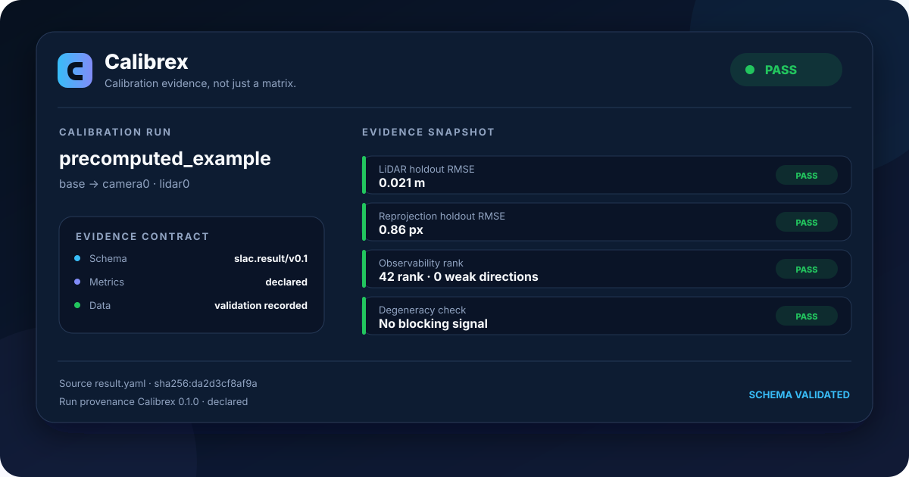
</p>

Generate the same artifact from any Calibrex result:

```bash
calibrex render result.yaml \
  --format evidence-card \
  --output evidence-card.svg
```

## Why evidence?

Most calibration tools stop after producing a transform. Calibrex asks the
next question: **what evidence would falsify this transform?**

| A matrix gives you | Calibrex adds |
|---|---|
| One estimated transform | Candidate, reference, and selected estimates kept separate |
| One training residual | Train/holdout metrics and temporal stability |
| Optimizer convergence | Known-bad perturbation challenges |
| A covariance matrix | Rank, weak directions, and degeneracy warnings |
| A screenshot | Schema-valid artifacts with input and producer provenance |
| A result file | A digest-locked evidence bundle that can be verified later |

### Compare candidates without hiding incompatibilities

This generated table compares the validated quickstart result with a declared
5° yaw / 0.15 m known-bad control. The amber protocol state is intentional:
these compact example results do not declare a shared evidence protocol, so
Calibrex shows the metric deltas but refuses to call the comparison compatible.

<p align="center">
  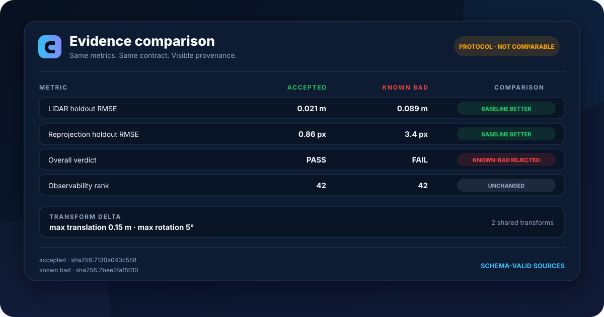
</p>

```bash
calibrex compare \
  examples/precomputed/result.yaml \
  examples/precomputed/known_bad_result.yaml \
  --format evidence-table \
  --left-label accepted \
  --right-label "known bad" \
  --output comparison-table.svg
```

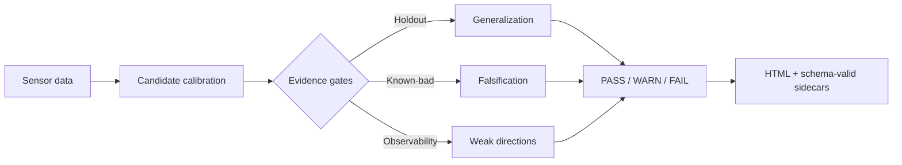

## Real data, honest verdicts

Calibrex does not turn every run green. Weak excitation and failed controls are
reported as evidence, not hidden as demo noise.

| v0.3 evidence on TIERS Indoor02 | Observation | Verdict |
|---|---:|:---:|
| Native-deskew identity selftest | translation error **9.5 cm → 4.3 cm** | Improved |
| Cross-segment trajectory drift proxy | **0.143 m** over 42 s | ✅ PASS |
| Two-pass odometry trajectory gate | **0.366 m** | ❌ FAIL |
| Anchored temporal +50 ms injection | offset tracked exactly | ✅ Detected |
| LiDAR-IMU rotation evidence | 3.56 deg/s holdout RMSE | ⚠️ Yaw limited |

The failure is part of the product: gates refuse to certify what the available
data cannot falsify.

## Public-data gallery

<table>
  <tr>
    <td width="33%">
      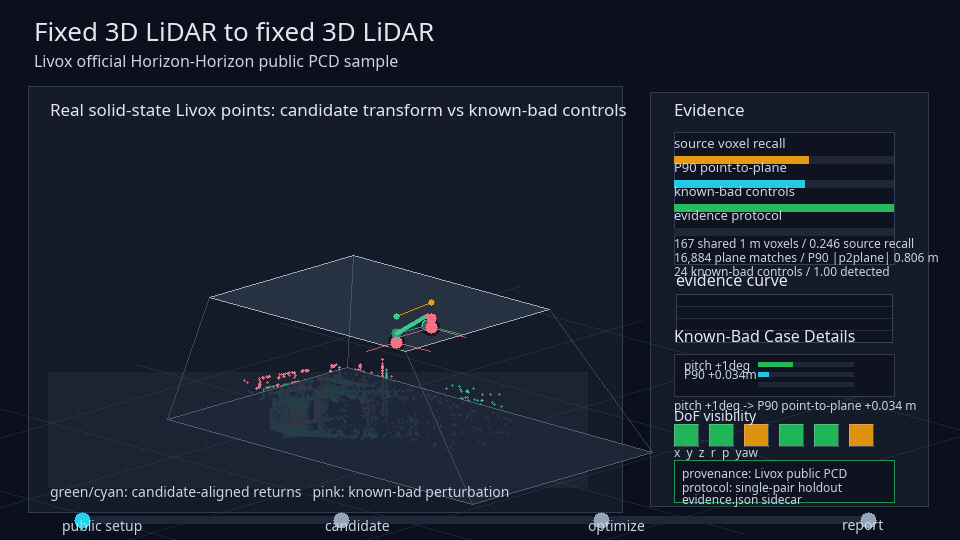
    </td>
    <td width="33%">
      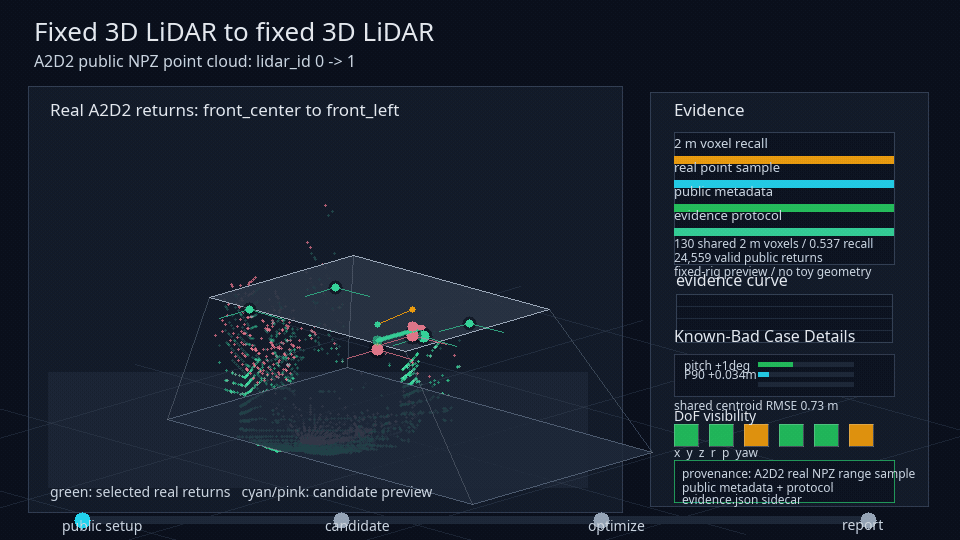
    </td>
    <td width="33%">
      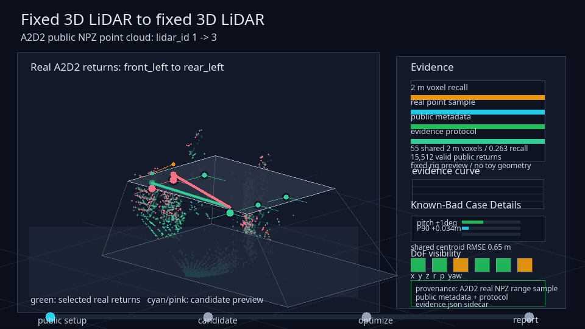
    </td>
  </tr>
  <tr>
    <td><sub><b>Livox Horizon ↔ Horizon</b><br>Known-bad controls and holdout point-to-plane evidence.</sub></td>
    <td><sub><b>A2D2 front pair</b><br>Fixed-rig metadata and support accounting.</sub></td>
    <td><sub><b>A2D2 front ↔ rear</b><br>A longer baseline with different overlap behavior.</sub></td>
  </tr>
</table>

<table>
  <tr>
    <td width="33%">
      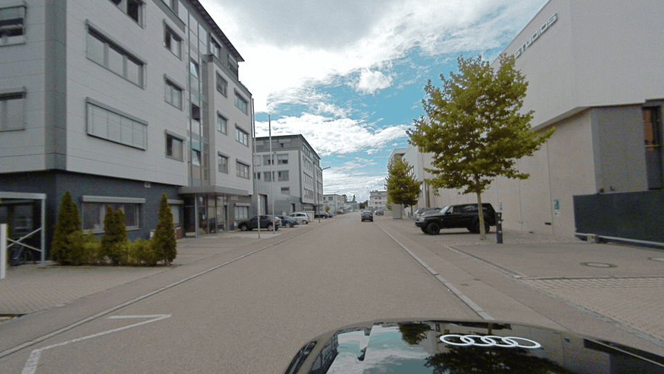
    </td>
    <td width="33%">
      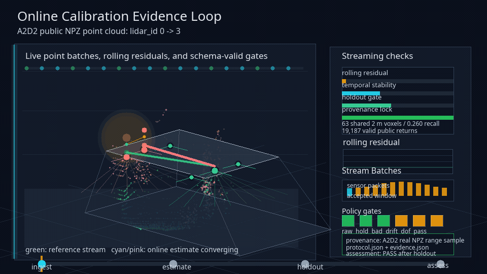
    </td>
    <td width="33%">
      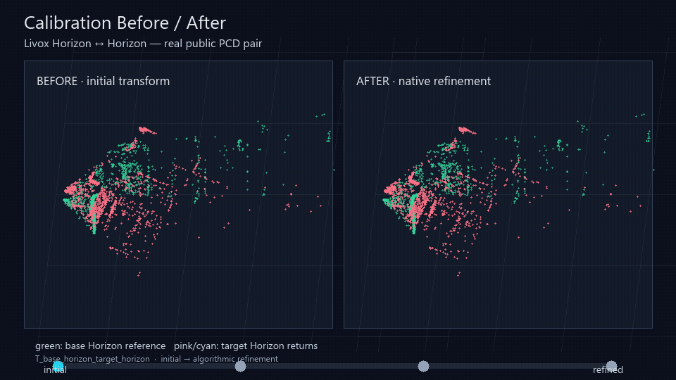
    </td>
  </tr>
  <tr>
    <td><sub><b>A2D2 camera × LiDAR</b><br>Real front-left camera frames with real camera-view LiDAR returns. A2D2 distributes these points pre-registered into the camera view, so this is visual evidence—not independent extrinsic accuracy.</sub></td>
    <td><sub><b>TIERS LidarsCali online</b><br>Real Livox Horizon ↔ Avia batches replayed through the online gate.</sub></td>
    <td><sub><b>Livox before → after</b><br>Real Horizon PCD returns through the native registration refinement replay; the public pair has no transform ground truth.</sub></td>
  </tr>
</table>

<p align="center">
  <sub>Every gallery asset is generated from public raw data. Dataset source,
  protocol, parameters, and digests are recorded in
  <a href="docs/assets/readme-gif-gallery.json"><code>readme-gif-gallery.json</code></a>.</sub>
</p>

## Install

Calibrex is currently distributed from source. The quickstart above installs
the core package; development and optional backends remain explicit:

```bash
python -m pip install -e ".[dev]"
python -m pip install -e ".[open3d]"
```

The core package stays ROS-independent. ROS bags are read through typed data
adapters, and GPL or ecosystem-specific tools stay behind optional adapter or
subprocess boundaries.

## Outputs you can inspect and verify

```text
result.yaml                  calibrated values + run provenance
├── report.html              portable human-readable report
├── metrics.json             train / holdout measurements
├── evidence.json            protocols, summaries, and known-bad cases
├── assessment.json          PASS / WARN / FAIL policy decision
├── observability.json       rank and weak directions
├── degeneracy.json          failure modes and limitations
├── protocol.json            declared evaluation contract
├── policy.json              falsification thresholds
├── transforms.json          typed transform provenance
├── bundle.json              artifact SHA-256 manifest
└── verification.json        materialized bundle verification
```

```bash
calibrex evidence result.yaml --output evidence.json
calibrex assess evidence.json
calibrex verify bundle.json
calibrex compare reference.yaml candidate.yaml --enforce-compatible
```

`render` never claims to recompute metrics. Cached inputs remain marked as
cached, raw-input verification remains visible, and incompatible protocols are
not silently ranked together.

## Reproduce the README visuals

The evidence card is deterministic and bound to its source result:

```bash
calibrex render examples/precomputed/result.yaml \
  --format evidence-card \
  --output docs/assets/readme-evidence-card.svg

calibrex compare \
  examples/precomputed/result.yaml \
  examples/precomputed/known_bad_result.yaml \
  --format evidence-table \
  --left-label accepted \
  --right-label "known bad" \
  --output docs/assets/readme-comparison-table.svg
```

The public-data GIF gallery has its own schema-valid manifest:

```bash
python tools/generate_calibration_evidence_gif.py --readme-gallery
```

Tests fail if the committed evidence card drifts from its validated source.

## Design principles

- Keep the sensor-agnostic core ROS-independent.
- Treat dataset calibration as reference evidence, not absolute truth.
- Require evaluation for calibration behavior changes.
- Record provenance for every generated result.
- Keep GPL and ecosystem tools behind adapters or subprocess boundaries.
- Preserve schema stability and evaluation quality over short-term convenience.

## Documentation

- [Documentation site](https://rsasaki0109.github.io/Calibrex/)
- [SLAC concept](docs/concepts/slac.md)
- [Calibration methods](docs/concepts/calibration_methods.md)
- [Solid-state LiDAR calibration](docs/concepts/solid_state_lidar.md)
- [Frame conventions](docs/concepts/frame_conventions.md)
- [Public datasets](docs/tutorials/public_datasets.md)
- [Open3D adapter](docs/tutorials/open3d_slac.md)
- [LiDAR-camera adapter](docs/tutorials/lidar_camera_adapter.md)
- [License boundaries](docs/concepts/license_boundaries.md)
- [Support](SUPPORT.md) · [Contributing](CONTRIBUTING.md) · [Security](SECURITY.md)

## License

[Apache-2.0](LICENSE). If you use Calibrex in research, see
[`CITATION.cff`](CITATION.cff).
