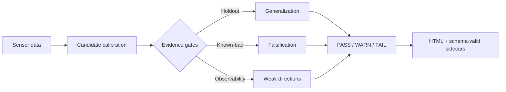

<h1 align="center">Calibrex</h1>

<p align="center">
  <strong>Calibration evidence, not just a matrix.</strong><br>
  Decide whether a robotics sensor calibration can actually be trusted.
</p>

<p align="center">
  <a href="https://github.com/rsasaki0109/Calibrex/actions/workflows/ci.yml"></a>
  
  
  
  
  
</p>

Calibrex turns candidate extrinsics, time offsets, and trajectories into
**PASS / WARN / FAIL evidence** backed by holdout metrics, known-bad controls,
observability checks, and reproducible provenance.

<p align="center">
  
</p>

<p align="center">
  <sub>Real TIERS Indoor02 moving-platform replay: a Velodyne VLP-16 motion map
  supports online Ouster OS1 calibration, with 106 of 108 batches accepted by
  holdout gates.</sub>
</p>

```bash
calibrex calibrate config.yaml
calibrex evaluate outputs/result.yaml
calibrex render outputs/result.yaml --format html
```

## See the evidence at a glance

The card below is not a hand-authored mockup. It is rendered from a
schema-valid [`result.yaml`](examples/precomputed/result.yaml), bound to the
source file by SHA-256, and committed with machine-readable provenance inside
the SVG.

<p align="center">
  
</p>

Generate the same artifact from any Calibrex result:

```bash
calibrex render result.yaml \
  --format evidence-card \
  --output evidence-card.svg
```

## Why evidence?

Most calibration tools stop after producing a transform. Calibrex asks the
next question: **what evidence would falsify this transform?**

| A matrix gives you | Calibrex adds |
|---|---|
| One estimated transform | Candidate, reference, and selected estimates kept separate |
| One training residual | Train/holdout metrics and temporal stability |
| Optimizer convergence | Known-bad perturbation challenges |
| A covariance matrix | Rank, weak directions, and degeneracy warnings |
| A screenshot | Schema-valid artifacts with input and producer provenance |
| A result file | A digest-locked evidence bundle that can be verified later |

### Compare candidates without hiding incompatibilities

This generated table compares the validated quickstart result with a declared
5° yaw / 0.15 m known-bad control. The amber protocol state is intentional:
these compact example results do not declare a shared evidence protocol, so
Calibrex shows the metric deltas but refuses to call the comparison compatible.

<p align="center">
  
</p>

```bash
calibrex compare \
  examples/precomputed/result.yaml \
  examples/precomputed/known_bad_result.yaml \
  --format evidence-table \
  --left-label accepted \
  --right-label "known bad" \
  --output comparison-table.svg
```



## Real data, honest verdicts

Calibrex does not turn every run green. Weak excitation and failed controls are
reported as evidence, not hidden as demo noise.

| v0.3 evidence on TIERS Indoor02 | Observation | Verdict |
|---|---:|:---:|
| Native-deskew identity selftest | translation error **9.5 cm → 4.3 cm** | Improved |
| Cross-segment trajectory drift proxy | **0.143 m** over 42 s | ✅ PASS |
| Two-pass odometry trajectory gate | **0.366 m** | ❌ FAIL |
| Anchored temporal +50 ms injection | offset tracked exactly | ✅ Detected |
| LiDAR-IMU rotation evidence | 3.56 deg/s holdout RMSE | ⚠️ Yaw limited |

The failure is part of the product: gates refuse to certify what the available
data cannot falsify.

## Public-data gallery

<table>
  <tr>
    <td width="33%">
      
    </td>
    <td width="33%">
      
    </td>
    <td width="33%">
      
    </td>
  </tr>
  <tr>
    <td><sub><b>Livox Horizon ↔ Horizon</b><br>Known-bad controls and holdout point-to-plane evidence.</sub></td>
    <td><sub><b>A2D2 front pair</b><br>Fixed-rig metadata and support accounting.</sub></td>
    <td><sub><b>A2D2 front ↔ rear</b><br>A longer baseline with different overlap behavior.</sub></td>
  </tr>
</table>

<p align="center">
  <sub>Every gallery asset is generated from public raw data. Dataset source,
  protocol, parameters, and digests are recorded in
  <a href="docs/assets/readme-gif-gallery.json"><code>readme-gif-gallery.json</code></a>.</sub>
</p>

## Calibration coverage

| Calibration path | Native solve | Evidence | Public example | Maturity |
|---|:---:|:---:|:---:|:---:|
| LiDAR ↔ LiDAR | ✅ | ✅ | ✅ | 🟢 Alpha |
| Camera ↔ LiDAR | ✅ | ✅ | ✅ | 🟡 Experimental |
| Hand-eye `AX=XB` | ✅ | ✅ | ✅ | 🟢 Alpha |
| Robot-world `AX=YB` | ✅ | ✅ | ✅ | 🟢 Alpha |
| LiDAR ↔ IMU | — | ✅ | ✅ | 🟡 Evidence |
| Radar extrinsic | ✅ | ✅ | ✅ | 🟡 Experimental |
| RGB-D joint SLAC | ✅ | ✅ | ✅ | 🟡 Experimental |
| Open3D / external tools | Adapter | ✅ | ✅ | 🔵 Adapter |

<p align="center">
  
</p>

<details>
<summary><b>What is implemented in the current alpha?</b></summary>

- typed config, result, comparison, protocol, policy, and evidence schemas
- offline and online/streaming LiDAR calibration for rosbag1, rosbag2, and MCAP
- motion compensation, per-point deskew, and trajectory evidence
- targetless camera-LiDAR mutual information and online monitoring
- native point-to-point, point-to-plane, hand-eye, and robot-world baselines
- backend-neutral joint SLAC with typed Schur pose elimination
- radar velocity, LiDAR-IMU rotation, and temporal-offset evidence
- Open3D, Kalibr-style, Koide-style, ROS, and Autoware adapter boundaries

See the [calibration methods](docs/concepts/calibration_methods.md) and
[changelog](CHANGELOG.md) for solver-level detail and limitations.

</details>

## Install

Calibrex is currently distributed from source:

```bash
git clone https://github.com/rsasaki0109/Calibrex.git
cd Calibrex
python -m pip install -e .
```

Development and optional backends remain explicit:

```bash
python -m pip install -e ".[dev]"
python -m pip install -e ".[open3d]"
```

The core package stays ROS-independent. ROS bags are read through typed data
adapters, and GPL or ecosystem-specific tools stay behind optional adapter or
subprocess boundaries.

## Five-minute quickstart

Render and validate the committed example without downloading a dataset:

```bash
calibrex doctor
calibrex validate examples/precomputed/result.yaml --json
calibrex render examples/precomputed/result.yaml \
  --format evidence-card \
  --output outputs/quickstart/evidence-card.svg
calibrex render examples/precomputed/result.yaml \
  --output-dir outputs/quickstart
```

Then run a public raw-data evidence demo:

```bash
calibrex public-datasets list
calibrex demo livox-evidence \
  --output-dir outputs/livox_horizon_horizon_pcd_sample
```

The demo downloads the declared public sample, recomputes its evidence, and
writes a verifiable bundle rather than silently reusing README numbers.

## Outputs you can inspect and verify

```text
result.yaml                  calibrated values + run provenance
├── report.html              portable human-readable report
├── metrics.json             train / holdout measurements
├── evidence.json            protocols, summaries, and known-bad cases
├── assessment.json          PASS / WARN / FAIL policy decision
├── observability.json       rank and weak directions
├── degeneracy.json          failure modes and limitations
├── protocol.json            declared evaluation contract
├── policy.json              falsification thresholds
├── transforms.json          typed transform provenance
├── bundle.json              artifact SHA-256 manifest
└── verification.json        materialized bundle verification
```

```bash
calibrex evidence result.yaml --output evidence.json
calibrex assess evidence.json
calibrex verify bundle.json
calibrex compare reference.yaml candidate.yaml --enforce-compatible
```

`render` never claims to recompute metrics. Cached inputs remain marked as
cached, raw-input verification remains visible, and incompatible protocols are
not silently ranked together.

## Reproduce the README visuals

The evidence card is deterministic and bound to its source result:

```bash
calibrex render examples/precomputed/result.yaml \
  --format evidence-card \
  --output docs/assets/readme-evidence-card.svg

calibrex compare \
  examples/precomputed/result.yaml \
  examples/precomputed/known_bad_result.yaml \
  --format evidence-table \
  --left-label accepted \
  --right-label "known bad" \
  --output docs/assets/readme-comparison-table.svg
```

The public-data GIF gallery has its own schema-valid manifest:

```bash
python tools/generate_calibration_evidence_gif.py --readme-gallery
```

Tests fail if the committed evidence card drifts from its validated source.

## Design principles

- Keep the sensor-agnostic core ROS-independent.
- Treat dataset calibration as reference evidence, not absolute truth.
- Require evaluation for calibration behavior changes.
- Record provenance for every generated result.
- Keep GPL and ecosystem tools behind adapters or subprocess boundaries.
- Preserve schema stability and evaluation quality over short-term convenience.

## Documentation

- [SLAC concept](docs/concepts/slac.md)
- [Calibration methods](docs/concepts/calibration_methods.md)
- [Frame conventions](docs/concepts/frame_conventions.md)
- [Public datasets](docs/tutorials/public_datasets.md)
- [Open3D adapter](docs/tutorials/open3d_slac.md)
- [LiDAR-camera adapter](docs/tutorials/lidar_camera_adapter.md)
- [License boundaries](docs/concepts/license_boundaries.md)
- [Support](SUPPORT.md) · [Contributing](CONTRIBUTING.md) · [Security](SECURITY.md)

## License

Apache-2.0.
