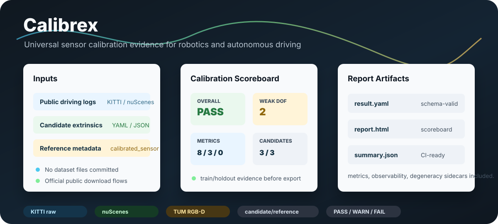

# Calibrex

**Universal Sensor Calibration Framework for Robotics**

Calibrex compares calibration estimates as evidence, not just matrices.

It lets you evaluate dataset references, manual candidates, native estimates,
online estimates, and external tool outputs through one schema, one CLI, one
metric suite, and one report.

```bash
calibrex calibrate config.yaml
calibrex evaluate outputs/result.yaml
calibrex visualize outputs/result.yaml --export-html
```

<p align="center">
  
  <br>
  <sub>A2D2 public LiDAR NPZ demo: fixed 3D LiDAR-to-LiDAR extrinsic comparison on real point-cloud returns.</sub>
</p>

<p align="center">
  
</p>

<p align="center">
  <a href="https://github.com/rsasaki0109/Calibrex/actions/workflows/ci.yml"></a>
  
  
  
</p>

## Why Calibrex

Most calibration tools output a transform. Calibrex tries to answer the next
question: **should this transform be trusted?**

It records:

- candidate, reference, and optimized extrinsics separately
- producer, role, execution mode, and evidence level for each estimate
- train/holdout metrics, perturbation sensitivity, and temporal stability
- observability and degeneracy warnings
- map/correspondence lineage and leakage checks
- portable HTML and machine-readable report sidecars

## Current Alpha

| Area | Status |
|---|---|
| Typed config/result schemas | Stable alpha |
| `calibrate`, `evaluate`, `visualize`, `compare`, `inspect`, `export` CLI | Stable alpha |
| KITTI raw fixed-vehicle LiDAR evaluation | Experimental end-to-end |
| nuScenes metadata and reference extrinsic import | Experimental |
| TUM RGB-D / Open3D SLAC adapter boundary | Experimental |
| Fixed-trajectory SE(3) LiDAR extrinsic correction solver | Native prototype |
| Koide-style LiDAR-camera result import / subprocess boundary | Adapter-only |
| Multi-LiDAR fixed-rig evidence visualization | Public setup demo |
| Radar native calibration | Planned |

<p align="center">
  
</p>

## Outputs

Calibrex writes schema-valid artifacts instead of one-off notebook state:

```text
result.yaml
report.html
summary.json
metrics.json
observability.json
degeneracy.json
artifacts/rig_3d.html
```

The 3D rig viewer can show reference, candidate, and online/estimated
extrinsics together.

## Install

```bash
pip install -e ".[dev]"
```

Optional backends stay optional:

```bash
pip install -e ".[dev,open3d]"
```

## Quickstart

```bash
calibrex doctor
calibrex init camera-lidar-imu --output config.yaml
calibrex calibrate config.yaml --output-dir outputs/example
calibrex validate outputs/example/result.yaml --json
calibrex evaluate outputs/example/result.yaml --export-html
calibrex visualize outputs/example/result.yaml --export-html
```

Public dataset examples:

```bash
calibrex public-datasets list
python tools/download_public_dataset.py a2d2_lidar_pair_sample --output-dir data/public
python tools/generate_calibration_evidence_gif.py
calibrex inspect examples/public_datasets/kitti_raw_2011_09_26_drive_0005 --type kitti-raw
calibrex calibrate examples/public_datasets/tum_rgbd_freiburg1_xyz/config.yaml
```

Compare two calibration runs:

```bash
calibrex compare outputs/reference/result.yaml outputs/candidate/result.yaml \
  --output outputs/comparison.json
```

## Design Principles

- Sensor-agnostic core; sensor-specific factors live at the edges.
- Core stays ROS-independent.
- Public dataset calibration is treated as a reference, not absolute truth.
- Evaluation is mandatory.
- Every result must carry provenance.
- GPL tools stay behind optional adapter or subprocess boundaries.

## Docs

- [SLAC concept](docs/concepts/slac.md)
- [Frame conventions](docs/concepts/frame_conventions.md)
- [Public datasets](docs/tutorials/public_datasets.md)
- [LiDAR-camera adapter](docs/tutorials/lidar_camera_adapter.md)

## License

Apache-2.0.
