<h1 align="center">Calibrex</h1>

<p align="center">
  <strong>Know whether your sensor calibration is trustworthy.</strong><br>
  Evaluate GNSS, IMU, LiDAR, camera, and vehicle (wheel odometry, INS) extrinsics and time offsets with holdouts, known-bad controls, and provenance you can reproduce.
</p>

<p align="center">
  <a href="https://github.com/rsasaki0109/Calibrex/actions/workflows/ci.yml"></a>
  <a href="https://github.com/rsasaki0109/Calibrex/releases/latest"></a>
  
  
  
  
  
</p>

Calibrex is an open-source, ROS-independent Python toolkit that turns candidate
extrinsics, time offsets, and trajectories into evidence backed by **holdout
metrics, known-bad controls, observability checks, and reproducible provenance**.
It ships native solvers for every sensor pair listed below, plus adapters for
Kalibr, Open3D, and Autoware, and it reports `pass`, `warn`, `fail`, or
`inconclusive` instead of optimizer convergence or a single training residual.

**Try it in your browser:** the
[browser calibration page](https://rsasaki0109.github.io/Calibrex/app/)
calibrates an IMU against a sensor trajectory (TUM): rotation, clock offset,
gyro bias, and lever arm, with held-out evidence. It runs locally under
Pyodide, so no data is uploaded.

<p align="center">
  <a href="https://rsasaki0109.github.io/Calibrex/"><strong>Documentation</strong></a>
  ·
  <a href="#pre-registered-sota-audits"><strong>SOTA audits</strong></a>
  ·
  <a href="#calibration-coverage"><strong>Coverage</strong></a>
  ·
  <a href="#public-data-gallery"><strong>Public-data gallery</strong></a>
  ·
  <a href="#five-minute-quickstart"><strong>Five-minute quickstart</strong></a>
  ·
  <a href="#solid-state-lidar-quickstart"><strong>Solid-state quickstart</strong></a>
  ·
  <a href="docs/concepts/calibration_methods.md"><strong>Calibration methods</strong></a>
  ·
  <a href="docs/tutorials/public_datasets.md"><strong>Public-data demos</strong></a>
</p>

## Pre-registered SOTA audits

Calibrex may call a method state of the art only for a claim that a frozen
audit marks `supported`. The claim, scoring, held-out data, and thresholds are
committed **before** the held-out data is scored, each piece of evidence is a
digest-pinned artifact, and refuted audits stay on the
[SOTA leaderboard](docs/benchmarks/sota_leaderboard.md). Standings as of
2026-10-01:

| Pair | Standing | Scope of the audited claim | Details |
|---|:---:|---|---|
| `imu-lidar` | supported 2, refuted 1 | Livox MID360 against LI-Init (GPL, run in a container): rotation and clock offset (4/4 gates), and the full extrinsic in a second round (4/4). The first full-extrinsic round was refuted (0/8) and stays listed. | [MID360 IMU-LiDAR](docs/benchmarks/mid360_imu_lidar.md) |
| `lidar-vehicle` | supported 1 | Motion-only LiDAR-to-vehicle rotation against KITTI's `calib_imu_to_velo` on eight unseen drives (3/3 gates). Pitch and yaw only; roll stays unobservable. | [KITTI LiDAR-vehicle](docs/benchmarks/kitti_lidar_vehicle.md#pre-registered-audit-supported) |
| `lidar-lidar` | refuted | NTU VIRAL (two Ouster OS1-16): refuted 2/4. Accuracy gates pass, but the method does not beat scan-to-scan and cross-recording consistency fails (1.143, bound 1.0). | [NTU VIRAL LiDAR-LiDAR](docs/benchmarks/ntu_viral_lidar_lidar.md#pre-registered-audit-refuted) |
| the other seven target pairs | no_claim | Native methods exist, but no audited claim yet. | [Leaderboard](docs/benchmarks/sota_leaderboard.md) |

A `supported` standing is scoped to one dataset family and one comparison; it
is not a general accuracy claim. Held-out data is reserved per pair, and a
spent split cannot be reused for a second claim. The machine-readable
standings are in
[`sota_leaderboard.json`](docs/assets/sota_leaderboard.json).

```bash
calibrex sota audit protocol.yaml --output audit.yaml   # exit 0 only for supported
```

## Calibration coverage

All ten target sensor pairs have a native method. "Audit standing" is the
standing on the [leaderboard](docs/benchmarks/sota_leaderboard.md).

| Pair | Native command | Public data used | Audit standing |
|---|---|---|:---:|
| camera (focal lengths) | `calibrex camera-imu focal` | Hilti 2022 | no_claim |
| camera ↔ IMU | `calibrex camera-imu rotation` | Hilti 2022 (dev exp21, exp07) | no_claim |
| camera ↔ LiDAR | `calibrex camera-lidar ...`, `calibrex demo kitti-lidar-camera-evidence` | KITTI-shaped fixture, A2D2, ACFR | no_claim |
| GNSS ↔ IMU | `calibrex gnss-imu compose` (from `calibrex gnss-lidar rtk-slam` and IMU-LiDAR) | RTK-SLAM | no_claim |
| IMU ↔ LiDAR | `calibrex imu-lidar livox`, `livox-translation`, `trajectory` | RTK-SLAM, Zenodo MID360 driving | **supported** (2) / refuted (1) |
| IMU ↔ vehicle | `calibrex imu-vehicle kitti` | KITTI raw | no_claim |
| INS ↔ LiDAR | `calibrex ins-lidar kitti` | KITTI raw | no_claim |
| LiDAR ↔ LiDAR | `calibrex lidar-lidar ros2` | NTU VIRAL | refuted |
| LiDAR ↔ vehicle | `calibrex lidar-vehicle kitti` | KITTI raw | **supported** (1) |
| LiDAR ↔ wheel odometry | `calibrex lidar-wheel trajectory`, `kitti` | KITTI raw (OXTS stands in for wheels) | no_claim |

Also native or adapter-backed: hand-eye `AX=XB` and robot-world `AX=YB`
(13 native methods, benchmarked below against OpenCV), radar extrinsics,
RGB-D joint SLAC, and solid-state LiDAR clock-offset profiling, mostly through
`calibrex calibrate <config>`. Open3D, Kalibr, Koide, ROS, and Autoware stay
behind adapters. See [calibration methods](docs/concepts/calibration_methods.md)
for solver-level detail, and the per-pair pages:
[IMU-LiDAR](docs/benchmarks/mid360_imu_lidar.md),
[LiDAR-vehicle](docs/benchmarks/kitti_lidar_vehicle.md),
[LiDAR-lidar](docs/benchmarks/ntu_viral_lidar_lidar.md),
[camera-IMU](docs/benchmarks/hilti_camera_imu.md),
[INS-LiDAR](docs/benchmarks/kitti_ins_lidar.md),
[LiDAR-wheel](docs/benchmarks/lidar_wheel_odometry.md),
[GNSS-LiDAR](docs/benchmarks/rtk_slam_gnss_lidar.md),
[GNSS-IMU](docs/benchmarks/rtk_slam_gnss_imu.md).

<p align="center">
  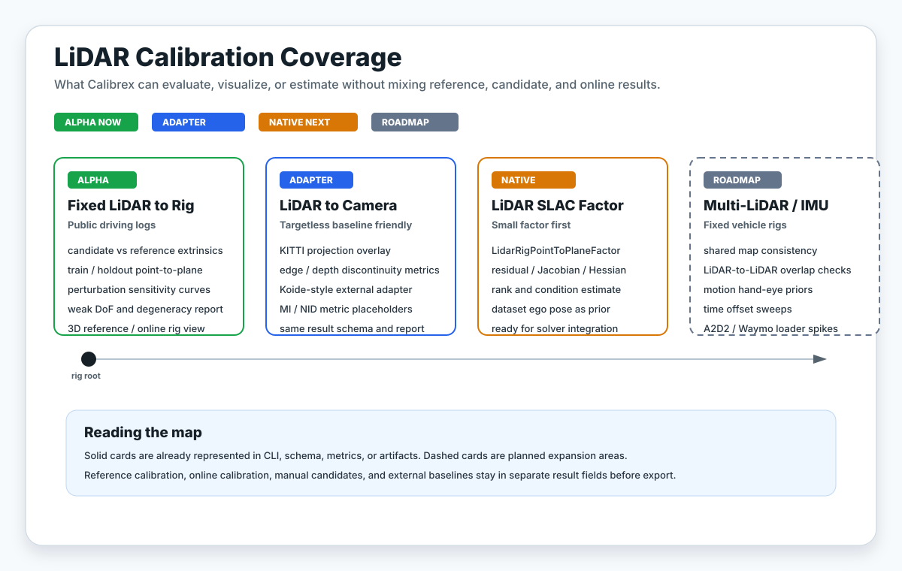
</p>

## Public-data gallery

<table>
  <tr>
    <td colspan="3">
      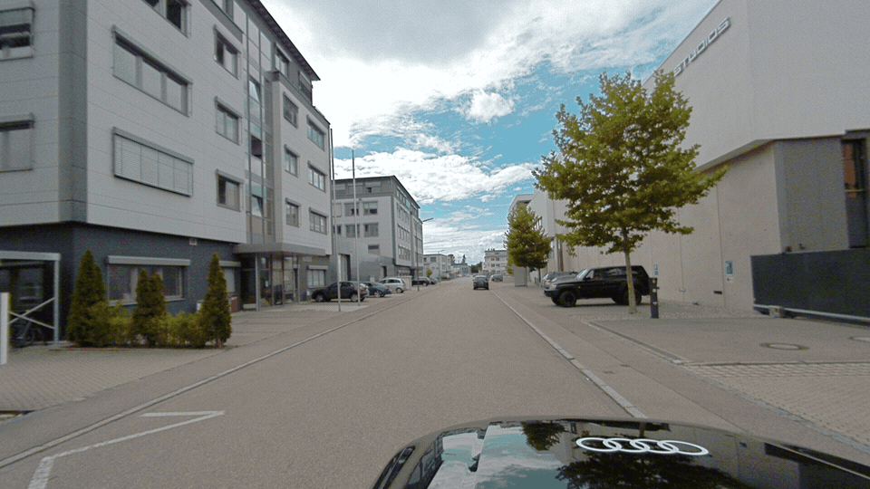
    </td>
  </tr>
  <tr>
    <td colspan="3">
      <sub><b>Real A2D2 camera × LiDAR:</b> front-left camera frames with real
      camera-view LiDAR returns. A2D2 distributes these points pre-registered into
      the camera view, so this is visual evidence—not independent extrinsic
      accuracy.</sub>
    </td>
  </tr>
  <tr>
    <td width="33%">
      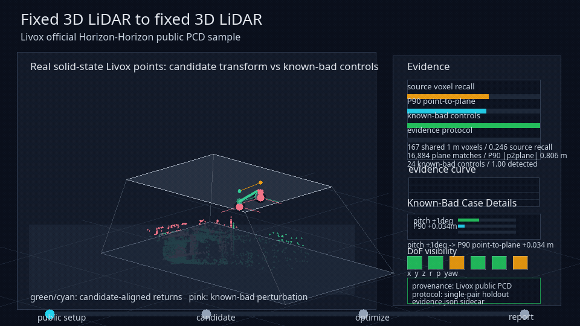
    </td>
    <td width="33%">
      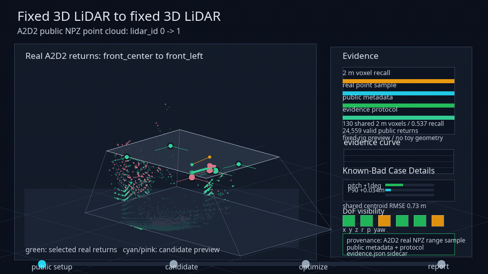
    </td>
    <td width="33%">
      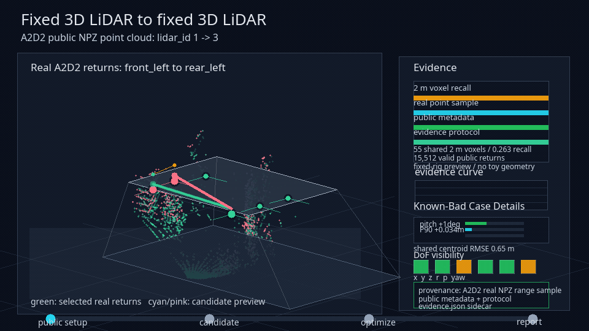
    </td>
  </tr>
  <tr>
    <td><sub><b>Livox Horizon ↔ Horizon</b><br>Known-bad controls and holdout point-to-plane evidence.</sub></td>
    <td><sub><b>A2D2 front pair</b><br>Fixed-rig metadata and support accounting.</sub></td>
    <td><sub><b>A2D2 front ↔ rear</b><br>A longer baseline with different overlap behavior.</sub></td>
  </tr>
  <tr>
    <td>
      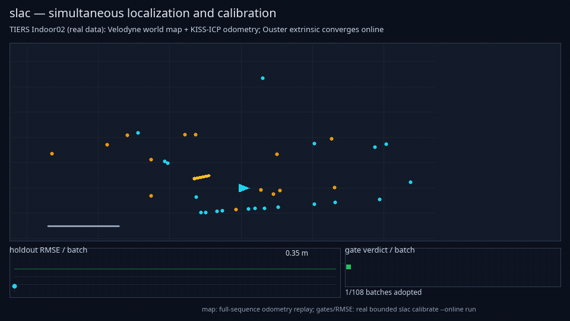
    </td>
    <td>
      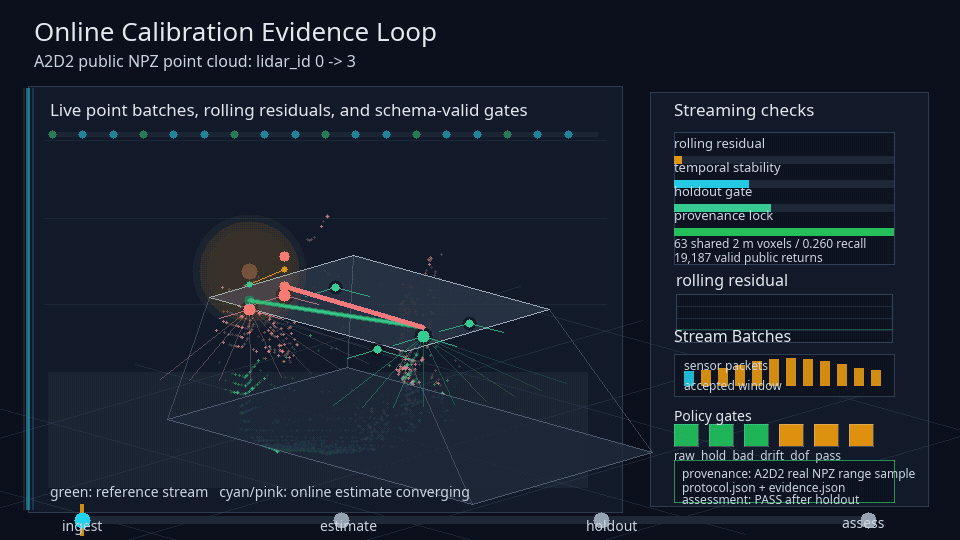
    </td>
    <td>
      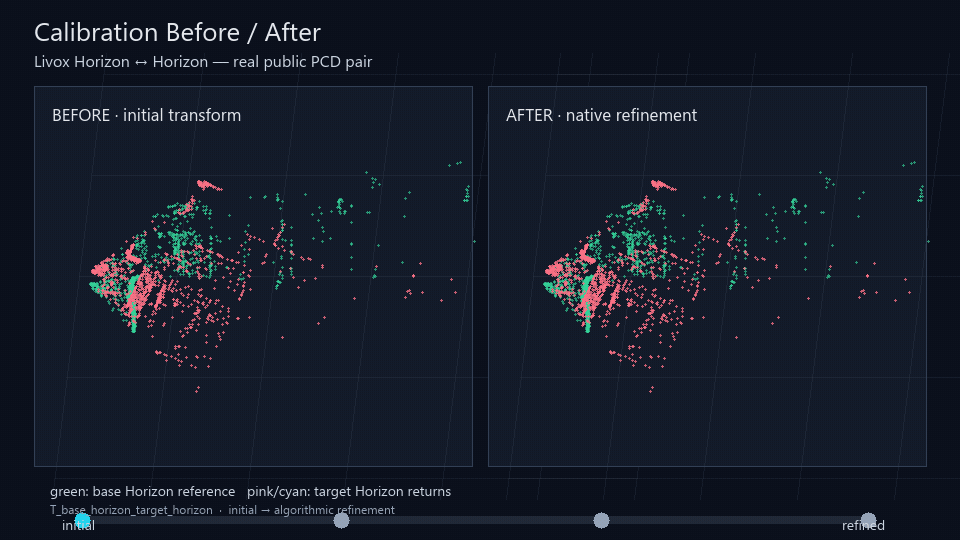
    </td>
  </tr>
  <tr>
    <td><sub><b>TIERS moving platform</b><br>A Velodyne VLP-16 motion map supports online Ouster OS1 calibration, with 106 of 108 batches accepted by holdout gates.</sub></td>
    <td><sub><b>TIERS LidarsCali online</b><br>Real Livox Horizon ↔ Avia batches replayed through the online gate.</sub></td>
    <td><sub><b>Livox before → after</b><br>Real Horizon PCD returns through the native registration refinement replay; the public pair has no transform ground truth.</sub></td>
  </tr>
  <tr>
    <td colspan="2">
      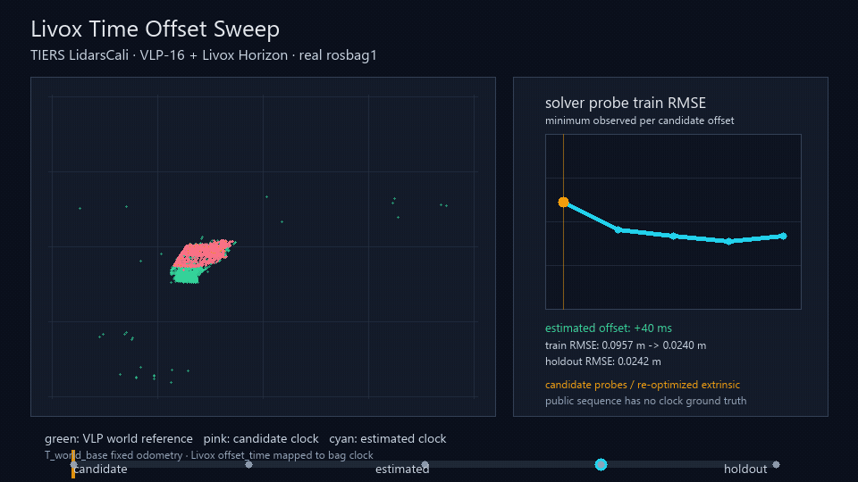
    </td>
    <td><sub><b>TIERS time-offset sweep</b><br>Real VLP-16 ↔ Livox Horizon candidate probes. The plot reports the algorithmic +40 ms estimate and re-optimized train/holdout RMSE; the public sequence has no independent clock ground truth.</sub></td>
  </tr>
</table>

<p align="center">
  <sub>Every gallery asset is generated from public raw data. Dataset source,
  protocol, parameters, and digests are recorded in
  <a href="docs/assets/readme-gif-gallery.json"><code>readme-gif-gallery.json</code></a>.</sub>
</p>

## Five-minute quickstart

Run the complete evidence path without ROS or a dataset download. The command
evaluates the bundled deterministic KITTI-shaped LiDAR-camera fixture, writes a
schema-valid result and review report, and verifies a digest-bound provenance
bundle:

```bash
python -m pip install \
  "https://github.com/rsasaki0109/Calibrex/releases/download/v0.4.1/calibrex-0.4.1-py3-none-any.whl"

calibrex demo kitti-lidar-camera-evidence \
  --output-dir outputs/kitti-lidar-camera-evidence \
  --strict-assessment
calibrex validate outputs/kitti-lidar-camera-evidence/result.yaml
calibrex verify outputs/kitti-lidar-camera-evidence/bundle.json
```

Open `outputs/kitti-lidar-camera-evidence/report.html` to inspect the projection
evidence and known-bad perturbation probes. The checked fixture detects 16 of
24 mandatory perturbation cases and passes all six falsification-policy gates
in under one minute in the clean Windows wheel smoke test. This verifies the
pipeline and evidence contracts; it is not a real-sensor accuracy claim or a
standalone camera-LiDAR calibration algorithm. Supply an officially downloaded
KITTI raw sequence with `--dataset-path` when evaluating real data.

To render and validate a committed result from a source checkout:

```bash
git clone https://github.com/rsasaki0109/Calibrex.git
cd Calibrex
python -m pip install .

calibrex validate examples/precomputed/result.yaml --json
calibrex render examples/precomputed/result.yaml \
  --format evidence-card \
  --output outputs/quickstart/evidence-card.svg
calibrex render examples/precomputed/result.yaml \
  --output-dir outputs/quickstart
```

Before configuring a solve, diagnose a recording and save the result for
review or CI:

```bash
calibrex doctor recording.mcap \
  --output outputs/doctor.json \
  --json
calibrex validate outputs/doctor.json
```

`doctor` infers supported dataset types, reports missing optional dependencies,
data coverage and degeneracy warnings, and suggests compatible evidence
workflows. Running it without a path retains the lightweight environment check.

Run the same evidence gates on every calibration change:

```yaml
- uses: actions/checkout@v4
- uses: rsasaki0109/Calibrex@v0.4.1
  with:
    candidate: calibration/candidate.yaml
    baseline: calibration/baseline.yaml
```

The action writes a GitHub Step Summary, fails on `FAIL` or `INCONCLUSIVE` by
default, and exposes schema-valid evidence, comparison, SVG, and
`calibration-ci.json` artifacts. See [Calibration CI](docs/tutorials/calibration_ci.md).

Tried it on your rig? Share a sanitized result or a useful failure case in the
[v0.4.1 launch discussion](https://github.com/rsasaki0109/Calibrex/discussions/61).
If the evidence-first workflow earns a place in your calibration stack,
consider starring Calibrex so other robotics teams can find it.

## Public real-data benchmarks

Calibrex evaluates all 13 native hand-eye methods and seven OpenCV 4 variants
on the [ETHZ ASL real robot-arm dataset](https://projects.asl.ethz.ch/datasets/hand-eye-calibration-2017/).
Every method sees the same five digest-locked absolute-pose splits. `AX=XB` and
`AX=YB` are separate equation families and are never ranked together.

### Hand-eye `AX=XB`

<!-- calibrex-benchmark:ethz-real-hand-eye-ax-xb-multiseed-2026-07-28:start -->
| Method | Holdout rotation RMSE deg ↓ | Holdout translation RMSE mm ↓ | Failure rate | Runtime s |
|---|---:|---:|---:|---:|
| Calibrex Park-Martin | 0.867227 [0.759962, 0.958155] | 13.8759 [11.7678, 15.8266] | 0.0% | 0.153451 |
| Calibrex Tsai-Lenz | 0.875291 [0.77004, 0.967317] | 13.8652 [11.7326, 15.8293] | 0.0% | 0.126921 |
| Calibrex Daniilidis | 0.868969 [0.761845, 0.960775] | **13.8212 [11.9121, 15.6887]** | 0.0% | 0.322403 |
| Calibrex Andreff | **0.867199 [0.759958, 0.958223]** | 13.879 [11.7674, 15.8309] | 0.0% | 0.334728 |
| Calibrex Shiu-Ahmad | 1.6191 [0.787831, 3.10277] | 31.9219 [12.7334, 52.761] | 0.0% | 14.1537 |
| Calibrex Chou-Kamel | 0.867205 [0.759953, 0.958241] | 13.8795 [11.7684, 15.8315] | 0.0% | 0.129661 |
| Calibrex Horaud-Dornaika | 0.890804 [0.782116, 0.996268] | 14.1434 [11.8641, 16.1088] | 0.0% | 0.139859 |
| Calibrex H-D nonlinear | 0.885789 [0.777979, 0.991045] | 14.0634 [11.8408, 16.0027] | 0.0% | 19.4512 |
| OpenCV Tsai | 0.871872 [0.769051, 0.961725] | 13.8681 [11.8255, 15.6992] | 0.0% | 0.0368567 |
| OpenCV Park | 0.867225 [0.759969, 0.958144] | 13.8754 [11.7667, 15.8261] | 0.0% | 0.0280751 |
| OpenCV Horaud | 0.867203 [0.759961, 0.958229] | 13.879 [11.7674, 15.831] | 0.0% | 0.0248639 |
| OpenCV Andreff | 0.868623 [0.763653, 0.959819] | 15.4855 [13.6068, 17.338] | 0.0% | 0.0327896 |
| OpenCV Daniilidis | 0.871005 [0.764385, 0.963618] | 13.9265 [11.9635, 15.6961] | 0.0% | 0.0284915 |
<!-- calibrex-benchmark:ethz-real-hand-eye-ax-xb-multiseed-2026-07-28:end -->

### Robot-world hand-eye `AX=YB`

<!-- calibrex-benchmark:ethz-real-robot-world-hand-eye-ax-yb-multiseed-2026-07-28:start -->
| Method | Holdout rotation RMSE deg ↓ | Holdout translation RMSE mm ↓ | Failure rate | Runtime s |
|---|---:|---:|---:|---:|
| Calibrex Shah | 0.624739 [0.559308, 0.688861] | 10.7793 [9.53397, 11.9952] | 0.0% | 0.0206115 |
| Calibrex Li-Wang-Wu | 0.627131 [0.561467, 0.692796] | 19.651 [15.2668, 23.3423] | 0.0% | 0.0321106 |
| Calibrex Dornaika-Horaud | 0.624742 [0.559311, 0.688865] | 10.7793 [9.53399, 11.9952] | 0.0% | 0.0286939 |
| Calibrex Zhuang-Roth-Sudhakar | 0.651861 [0.569557, 0.733996] | 10.961 [9.65144, 12.1956] | 0.0% | 0.0213057 |
| Calibrex D-H nonlinear | 0.6265 [0.560987, 0.692012] | **10.7752 [9.52577, 12.0161]** | 0.0% | 0.217955 |
| OpenCV Shah | **0.624739 [0.559308, 0.688861]** | 10.7793 [9.53397, 11.9952] | 0.0% | 0.00343018 |
| OpenCV Li | 0.627131 [0.561467, 0.692796] | 19.651 [15.2668, 23.3423] | 0.0% | 0.00570322 |
<!-- calibrex-benchmark:ethz-real-robot-world-hand-eye-ax-yb-multiseed-2026-07-28:end -->

These are scoped consistency results, not blanket accuracy claims: the archive
does not provide an accepted ground-truth extrinsic. The tables report closure
RMSE on untouched holdout poses, retain failures in the denominator, and show
95% bootstrap intervals across splits. See the [full protocol, citations,
limitations, and reproducible provenance](docs/benchmarks/ethz_hand_eye_opencv.md).

## Solid-state LiDAR quickstart

Start with the small Livox sample for a fast, no-ROS check. It writes a
calibrated `result.yaml`, `report.html`, evidence sidecars, and a verified
provenance bundle:

```bash
python -m pip install .
calibrex demo livox-evidence \
  --output-dir outputs/solid-state-livox-demo \
  --json
calibrex validate outputs/solid-state-livox-demo/result.yaml
calibrex verify outputs/solid-state-livox-demo/bundle.json
```

- **Real timing and clock offset.** The public TIERS VLP-16 ↔ Livox Horizon
  bag (about 7.18 GB, never downloaded automatically) is profiled with
  `calibrex continuous-time-lidar-pair`; see the
  [public-dataset tutorial](docs/tutorials/public_datasets.md#tiers-lidarscali-ros-1-bag-livox-horizon--avia).
  On the checked run the selected offset was **+40 ms** and train RMSE changed
  from **0.0957 m to 0.0240 m**, with **0.0242 m** holdout RMSE. This is an
  algorithmic estimate under the declared holdout: the public sequence has no
  independent clock ground truth.
- **Synthetic truth gate.** A deterministic benchmark recovers a known
  extrinsic and **+30 ms** clock offset and rejects a fixed-clock known-bad
  control (`tools/run_solid_state_synthetic_benchmark.py`). It verifies solver
  mechanics, not real-sensor accuracy. See the
  [YAML artifact](docs/assets/solid-state-synthetic-benchmark-v01.yaml) and
  [report](docs/assets/solid-state-synthetic-benchmark-v01.md).
- **Public cross-dataset benchmark.** Paired solver variants are compared on
  the same capture windows, temporal holdouts, and sampling seeds. In the v0.3
  matrix, adaptive wins 23/27 replicates with mean improvement 47.70%
  (bootstrap 95% CI [34.43, 59.99]%); AgRob Modular-e stays a visible
  counterexample (5/9, mean −1.34%). The public-only v0.4 candidate scores
  **27/27** replicates: adaptive wins **25/27**, mean improvement **57.20%**
  (95% CI **[45.69, 67.43]%**), and 9 of 54 variant artifacts hit the declared
  `max_iterations` category. See the
  [v0.3 report](docs/assets/solid-state-cross-dataset-benchmark-v03.md),
  [v0.4 report](docs/assets/solid-state-cross-dataset-benchmark-v04.md), and
  [train-only selection note](docs/assets/solid-state-cross-dataset-benchmark-v04-train-selection.md).
  These are ground-truth-free temporal-holdout results, not an absolute
  accuracy or SOTA claim.

Full commands for every step are in the
[solid-state public benchmark runbook](docs/tutorials/solid_state_public_benchmark.md).
The independent physical-metrology packet remains an optional future path and
is checked in as a planned template, not a result:
[YAML](docs/assets/solid-state-metrology-evaluation-v01.yaml) and
[report](docs/assets/solid-state-metrology-evaluation-v01.md).

<details>
<summary><b>What is implemented in the current alpha?</b></summary>

- typed config, result, comparison, protocol, policy, and evidence schemas
- native solvers for camera-IMU, IMU-LiDAR, GNSS-LiDAR/IMU, LiDAR-LiDAR,
  LiDAR/IMU-vehicle, LiDAR-wheel odometry, and INS-LiDAR, each with held-out
  windows, a block jackknife, and known-bad controls
- pair-agnostic pre-registered SOTA audits and per-pair standings (`calibrex sota`)
- offline and online/streaming LiDAR calibration for rosbag1, rosbag2, and MCAP
- motion compensation, per-point deskew, and trajectory evidence
- targetless camera-LiDAR mutual information and online monitoring
- native point-to-point, point-to-plane, hand-eye, and robot-world baselines
- backend-neutral joint SLAC with typed Schur pose elimination
- radar velocity, LiDAR-IMU rotation, and temporal-offset evidence
- typed external-run artifacts, a Kalibr camchain importer, and Koide/Open3D,
  ROS, and Autoware adapter boundaries
- a frozen, SHA-bound full-scale KITTI reference-vs-known-bad falsification runner

See the [calibration methods](docs/concepts/calibration_methods.md) and
[changelog](CHANGELOG.md) for solver-level detail and limitations.

</details>

## Real data, honest verdicts

Calibrex does not turn every run green. Weak excitation, failed controls, and
refuted audits are reported as evidence, not hidden as demo noise. A sample of
current results from the benchmark pages:

| Pair / data | Result | Verdict |
|---|---|:---:|
| `lidar-lidar`, NTU VIRAL held-out audit | Accuracy gates pass (0.489 deg, 0.077 m to design), but no gain over scan-to-scan (paired CI low −0.0048) and cross-recording consistency 1.143 vs bound 1.0; 2/4 gates | ❌ Refuted |
| `imu-lidar`, first full-extrinsic audit vs LI-Init | Lever-arm x unobservable on both recordings, so the claim was contradicted; kept on the leaderboard beside the later supported round | ❌ Refuted |
| `camera-imu`, Hilti 2022 dev (exp21, exp07), 10 camera runs | 5 pass, 1 warn, 4 inconclusive; side and down cameras on exp07 still do not constrain rotation (jackknife 0.35-0.7 deg) | ⚠️ Inconclusive |
| `ins-lidar`, KITTI drives 0005 + 0009 | Roll, pitch, and clock offset estimated; yaw and translations unobservable | ⚠️ Inconclusive |
| `lidar-wheel`, KITTI (OXTS stand-in) | Rotation matches lidar-vehicle within 0.004 deg; a 1 % speed-scale control is not detected | ⚠️ Warn |
| `imu-lidar`, MID360 driving | Roll estimated; yaw unobservable because a vehicle rotates almost only about the vertical axis | ⚠️ Inconclusive |
| `imu-lidar`, MID360 hand-held (RTK-SLAM seq2) | Every rotation axis estimated; held-out windows detect every known-bad shift | ✅ Pass |

The failure is part of the product: gates refuse to certify what the available
data cannot falsify.

## Why evidence?

Most calibration tools stop after producing a transform. Calibrex asks the
next question: **what evidence would falsify this transform?**

| A matrix gives you | Calibrex adds |
|---|---|
| One estimated transform | Candidate, reference, and selected estimates kept separate |
| One training residual | Train/holdout metrics and temporal stability |
| Optimizer convergence | Known-bad perturbation challenges |
| A covariance matrix | Rank, weak directions, and degeneracy warnings |
| A screenshot | Schema-valid artifacts with input and producer provenance |
| A result file | A digest-locked evidence bundle that can be verified later |

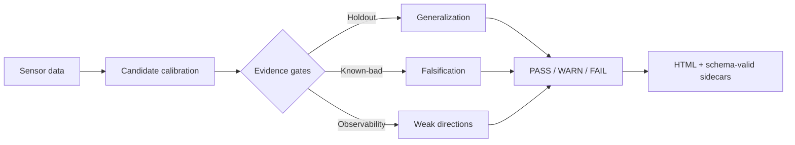
```mermaid
flowchart LR
    A[Sensor data] --> B[Candidate calibration]
    B --> C{Evidence gates}
    C -->|Holdout| D[Generalization]
    C -->|Known-bad| E[Falsification]
    C -->|Observability| F[Weak directions]
    D --> G[PASS / WARN / FAIL]
    E --> G
    F --> G
    G --> H[HTML + schema-valid sidecars]
```

## See the evidence at a glance

The card below is not a hand-authored mockup. It is rendered from a
schema-valid [`result.yaml`](examples/precomputed/result.yaml), bound to the
source file by SHA-256, and committed with machine-readable provenance inside
the SVG.

<p align="center">
  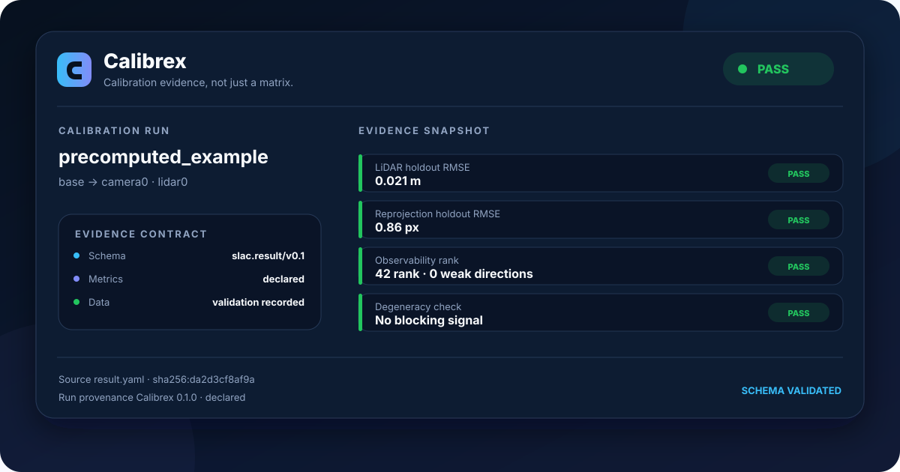
</p>

Generate the same artifact from any Calibrex result:

```bash
calibrex render result.yaml \
  --format evidence-card \
  --output evidence-card.svg
```

### Compare candidates without hiding incompatibilities

This generated table compares the validated quickstart result with a declared
5° yaw / 0.15 m known-bad control. The amber protocol state is intentional:
these compact example results do not declare a shared evidence protocol, so
Calibrex shows the metric deltas but refuses to call the comparison compatible.

<p align="center">
  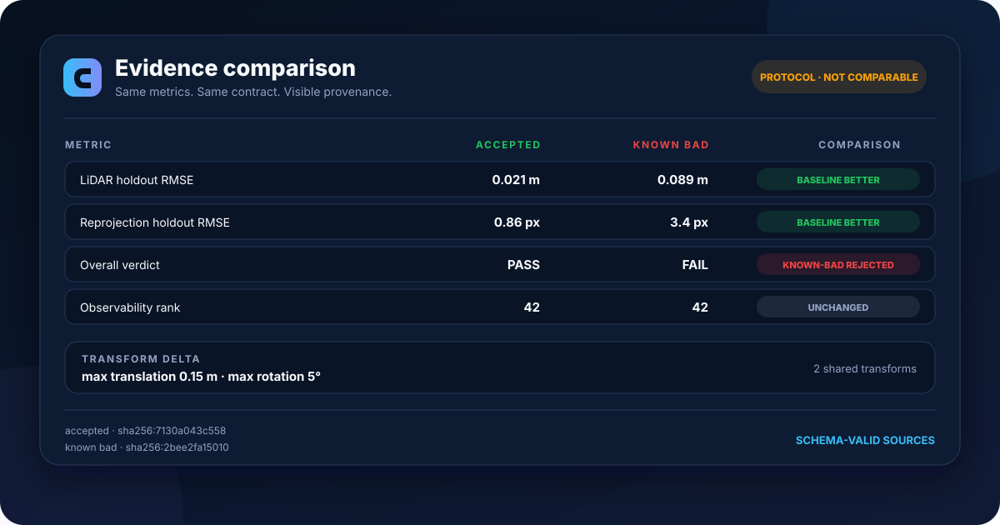
</p>

```bash
calibrex compare \
  examples/precomputed/result.yaml \
  examples/precomputed/known_bad_result.yaml \
  --format evidence-table \
  --left-label accepted \
  --right-label "known bad" \
  --output comparison-table.svg
```

## Outputs you can inspect and verify

```text
result.yaml                  calibrated values + run provenance
├── report.html              portable human-readable report
├── metrics.json             train / holdout measurements
├── evidence.json            protocols, summaries, and known-bad cases
├── assessment.json          PASS / WARN / FAIL policy decision
├── observability.json       rank and weak directions
├── degeneracy.json          failure modes and limitations
├── protocol.json            declared evaluation contract
├── policy.json              falsification thresholds
├── transforms.json          typed transform provenance
├── bundle.json              artifact SHA-256 manifest
└── verification.json        materialized bundle verification
```

```bash
calibrex evidence result.yaml --output evidence.json
calibrex assess evidence.json
calibrex verify bundle.json
calibrex compare reference.yaml candidate.yaml --enforce-compatible
```

`render` never claims to recompute metrics. Cached inputs remain marked as
cached, raw-input verification remains visible, and incompatible protocols are
not silently ranked together.

## Install

The supported no-source install is the versioned wheel attached to the
[v0.4.1 GitHub Release](https://github.com/rsasaki0109/Calibrex/releases/tag/v0.4.1):

```bash
python -m pip install \
  "https://github.com/rsasaki0109/Calibrex/releases/download/v0.4.1/calibrex-0.4.1-py3-none-any.whl"
```

Development checkouts and optional backends remain explicit:

```bash
python -m pip install -e ".[dev]"
python -m pip install -e ".[open3d]"
```

The core package stays ROS-independent. ROS bags are read through typed data
adapters, and GPL or ecosystem-specific tools (for example LI-Init, used only
as an audit baseline in a container) stay behind optional adapter or
subprocess boundaries.

## Reproduce the README visuals

The evidence card is deterministic and bound to its source result:

```bash
calibrex render examples/precomputed/result.yaml \
  --format evidence-card \
  --output docs/assets/readme-evidence-card.svg

calibrex compare \
  examples/precomputed/result.yaml \
  examples/precomputed/known_bad_result.yaml \
  --format evidence-table \
  --left-label accepted \
  --right-label "known bad" \
  --output docs/assets/readme-comparison-table.svg
```

The public-data GIF gallery has its own schema-valid manifest:

```bash
python tools/generate_calibration_evidence_gif.py --readme-gallery
```

Tests fail if the committed evidence card drifts from its validated source.

## Design principles

- Keep the sensor-agnostic core ROS-independent.
- Treat dataset calibration as reference evidence, not absolute truth.
- Require evaluation for calibration behavior changes.
- Record provenance for every generated result.
- Keep GPL and ecosystem tools behind adapters or subprocess boundaries.
- Preserve schema stability and evaluation quality over short-term convenience.

## Documentation

- [Documentation site](https://rsasaki0109.github.io/Calibrex/)
- [SOTA leaderboard](docs/benchmarks/sota_leaderboard.md)
- Benchmark pages: [MID360 IMU-LiDAR](docs/benchmarks/mid360_imu_lidar.md) ·
  [KITTI LiDAR-vehicle](docs/benchmarks/kitti_lidar_vehicle.md) ·
  [NTU VIRAL LiDAR-LiDAR](docs/benchmarks/ntu_viral_lidar_lidar.md) ·
  [Hilti camera-IMU](docs/benchmarks/hilti_camera_imu.md) ·
  [KITTI INS-LiDAR](docs/benchmarks/kitti_ins_lidar.md) ·
  [LiDAR-wheel odometry](docs/benchmarks/lidar_wheel_odometry.md) ·
  [RTK-SLAM GNSS-LiDAR](docs/benchmarks/rtk_slam_gnss_lidar.md) ·
  [RTK-SLAM GNSS-IMU](docs/benchmarks/rtk_slam_gnss_imu.md) ·
  [ETHZ hand-eye](docs/benchmarks/ethz_hand_eye_opencv.md) ·
  [ETHZ robot-world](docs/benchmarks/ethz_robot_world_hand_eye.md)
- [SLAC concept](docs/concepts/slac.md)
- [Calibration methods](docs/concepts/calibration_methods.md)
- [Solid-state LiDAR calibration](docs/concepts/solid_state_lidar.md)
- [Frame conventions](docs/concepts/frame_conventions.md)
- [Public datasets](docs/tutorials/public_datasets.md)
- [Your own data](docs/tutorials/your_own_data.md) · [Browser calibration](docs/tutorials/browser_calibration.md)
- [Open3D adapter](docs/tutorials/open3d_slac.md)
- [LiDAR-camera adapter](docs/tutorials/lidar_camera_adapter.md)
- [License boundaries](docs/concepts/license_boundaries.md)
- [Support](SUPPORT.md) · [Contributing](CONTRIBUTING.md) · [Security](SECURITY.md)

## License

[Apache-2.0](LICENSE). If you use Calibrex in research, see
[`CITATION.cff`](CITATION.cff).
