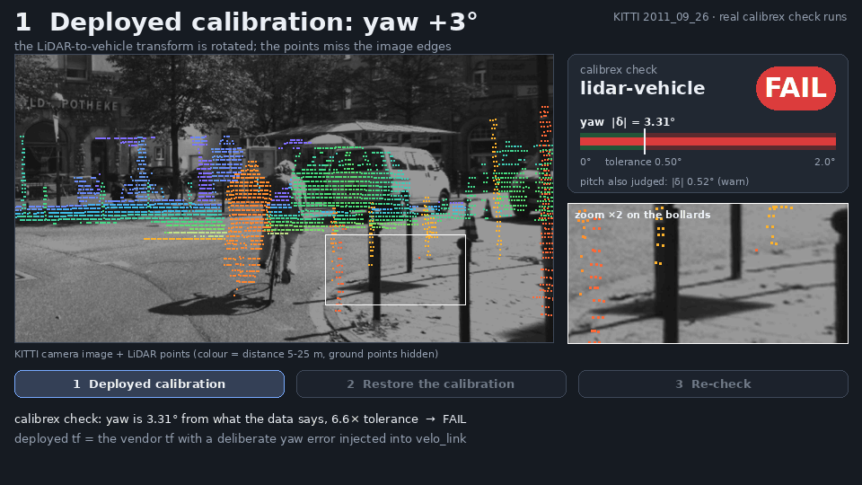
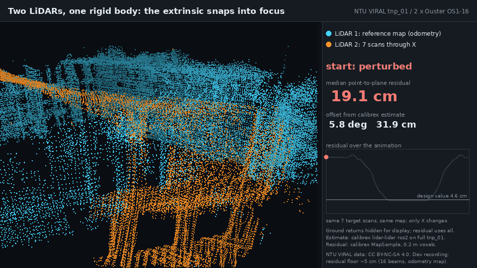
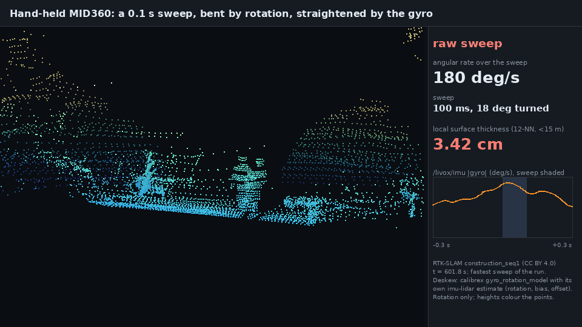
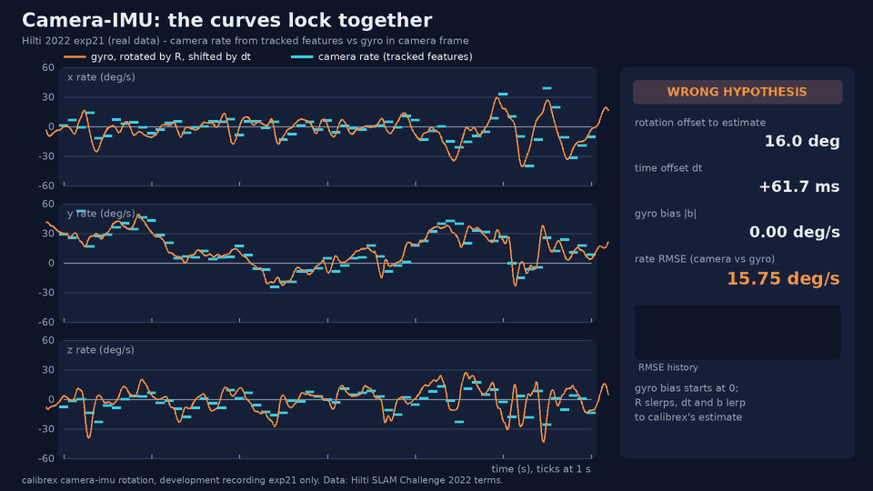
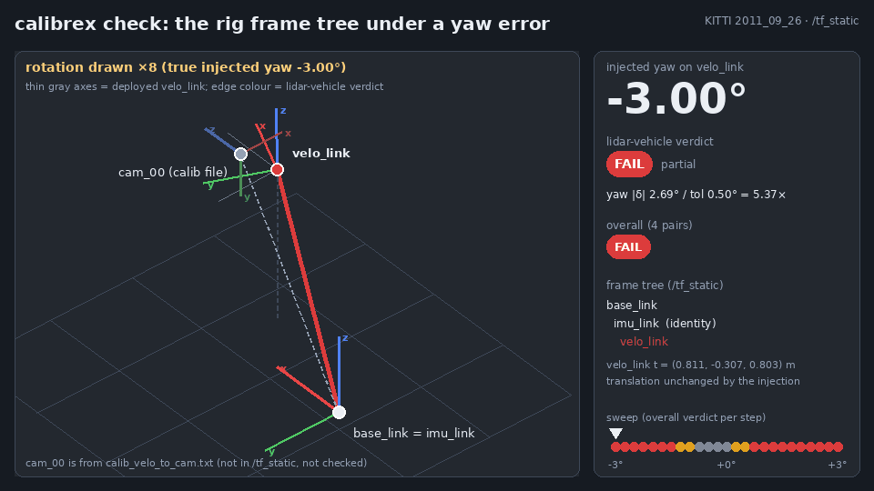

<div class="cx-hero" markdown="1">

<p class="cx-eyebrow">Calibration evidence framework for robotics</p>

# Check whether the sensor calibration on your robot is still right.

<p class="cx-sub">One command, honest per-axis verdicts for LiDAR, IMU, camera, GNSS, and vehicle. Calibrex reads the transforms your robot is running, compares them with its own recorded data, and says plainly which axes it could not judge.</p>

<div class="cx-buttons" markdown="1">

[Get started](getting_started.md){ .md-button .md-button--primary }
[Check a bag in the browser](app/check.html){ .md-button }
[Calibrate an IMU in the browser](app/){ .md-button }
[GitHub :fontawesome-brands-github:](https://github.com/rsasaki0109/Calibrex){ .md-button }

</div>

<div class="cx-visual"></div>

<p class="cx-caption">Real <code>calibrex check</code> runs on KITTI development drives: a deployed LiDAR transform
with a 3° yaw error <b>fails</b>; restoring the calibration file and re-checking
<b>passes</b> (pitch and yaw judged; roll is not observable from driving).</p>

</div>

<div class="cx-section" markdown="1">

## What it does

<div class="grid cards" markdown>

-   :material-console-line: **One command, ten sensor pairs**

    ---

    `calibrex check` reads `/tf_static` from a ROS 2 bag and checks every sensor pair it finds,
    from LiDAR-vehicle to camera-IMU.

-   :material-ruler-square: **Honest per-axis verdicts**

    ---

    Partial coverage is named, not hidden: a `pass` covers only the judged axes, and
    detection power tells you whether the data could have caught a wrong calibration.

-   :material-web: **Plan a check in your browser**

    ---

    Drop a ROS 2 bag on the [bag check page](app/check.html) to see which sensor pairs
    `calibrex check` can check and why others are skipped. Files are read in place
    and never uploaded.

-   :material-flag-checkered: **Pre-registered SOTA claims**

    ---

    Thresholds are frozen before held-out data is scored, and claims that fail stay on the
    [leaderboard](benchmarks/sota_leaderboard.md).

-   :material-shield-check-outline: **Evidence and provenance**

    ---

    Configs and results are schema-validated, every report records its inputs, and the
    README GIFs are digest-bound to their sources.

</div>

</div>

<div class="cx-section" markdown="1">

## Real data, rendered by the code

Every frame comes from a real recording, rendered by Calibrex's own code.

<div class="cx-showcase">
  <figure>
    
    <figcaption><b>LiDAR ↔ LiDAR snaps into focus</b> (NTU VIRAL tnp_01). From a labelled perturbed start to the <code>calibrex lidar-lidar</code> estimate; median point-to-plane residual 19.1 → 4.4 cm (the design value gives 4.6 cm).</figcaption>
  </figure>
  <figure>
    
    <figcaption><b>Gyro deskew</b> (RTK-SLAM, hand-held MID360. The fastest sweep of the run, 180 deg/s: raw vs deskewed with Calibrex's own IMU-LiDAR estimate; local surface thickness 3.42 → 2.19 cm.)</figcaption>
  </figure>
  <figure>
    
    <figcaption><b>Camera ↔ IMU curves lock together</b> (Hilti 2022 exp21, development data. Rate RMSE 15.8 → 6.2 deg/s (the floor is camera-rate noise); the estimate is 0.45° and −0.21 ms from Kalibr's target-based calibration.)</figcaption>
  </figure>
  <figure>
    
    <figcaption><b>The rig under a yaw error</b> (KITTI <code>/tf_static</code>. Rotation drawn ×8 for visibility; colours follow the real <code>calibrex check</code> verdict at each step.)</figcaption>
  </figure>
</div>

</div>

<div class="cx-section" markdown="1">

## SOTA standings

Calibrex calls a method state of the art only for a claim that a frozen,
pre-registered audit marks `supported`. Refuted audits are listed too.

| Pair | Standing | Notes |
|---|---|---|
| `imu-lidar` | <span class="cx-pill supported">supported</span> | Livox MID360 against LI-Init: rotation and clock offset, and the full extrinsic in a second round (the first round was refuted) |
| `lidar-vehicle` | <span class="cx-pill supported">supported</span> | KITTI motion-only rotation against calib_imu_to_velo, eight unseen drives |
| `lidar-lidar` | <span class="cx-pill refuted">refuted</span> | NTU VIRAL, 2/4 gates |
| `camera-imu` | <span class="cx-pill refuted">refuted</span> | Hilti 2022 against Kalibr, 6/7 gates |
| `camera`, `camera-lidar`, `gnss-imu`, `imu-vehicle`, `ins-lidar`, `lidar-wheel_odometry` | <span class="cx-pill no_claim">no_claim</span> | Native method, no audited claim yet |

[Full leaderboard and protocols :material-arrow-right:](benchmarks/sota_leaderboard.md){ .md-button }

</div>

<div class="cx-section" markdown="1">

## Quickstart

```bash
python -m pip install "https://github.com/rsasaki0109/Calibrex/releases/download/v0.5.1/calibrex-0.5.1-py3-none-any.whl"
calibrex check my_bag/ --html check.html
```

See [Install and first check](getting_started.md), or the
[check tutorial](tutorials/calibrex_check.md) for the KITTI yaw-injection demo.

## Hand-eye benchmark

Five `AX=YB` methods were recomputed on the
[ETHZ ASL real robot-arm dataset](https://projects.asl.ethz.ch/datasets/hand-eye-calibration-2017/)
with one shared 80/20 split.

<!-- calibrex-benchmark:ethz-real-robot-world-hand-eye-2026-07-28:start -->
| Method | Rotation holdout RMSE deg ↓ | Translation holdout RMSE mm ↓ | Known-bad detection fraction ↑ | Failure rate | Runtime s |
|---|---:|---:|---:|---:|---:|
| Shah | **0.585795** | 10.0628 | **1** | 0.0% | — |
| Li-Wang-Wu | 0.58728 | 17.458 | **1** | 0.0% | — |
| Dornaika-Horaud | 0.585795 | 10.0628 | **1** | 0.0% | — |
| Zhuang-Roth-Sudhakar | 0.590747 | 10.132 | **1** | 0.0% | — |
| Calibrex nonlinear refinement | 0.58721 | **10.0394** | **1** | 0.0% | — |
<!-- calibrex-benchmark:ethz-real-robot-world-hand-eye-2026-07-28:end -->

Calibrex's nonlinear refinement is best on translation in this benchmark;
Shah is marginally best on rotation. These are held-out closure errors, not
ground-truth extrinsic errors. Read the [benchmark protocol and
provenance](benchmarks/ethz_robot_world_hand_eye.md).

## Integration paths

- [Open3D SLAC adapter](tutorials/open3d_slac.md)
- [Targetless LiDAR-camera adapter](tutorials/lidar_camera_adapter.md)
- [Solid-state LiDAR calibration](concepts/solid_state_lidar.md)
- [Problem builder](concepts/problem_builder.md)
- [Schema reference](reference/schemas.md)
- [License boundaries](concepts/license_boundaries.md)

## Current status

Calibrex is alpha research software. Failed controls are reported rather than
hidden; see the [changelog](changelog.md) and
[development roadmap](development_roadmap.md) for current limitations. Read the
[frame conventions](concepts/frame_conventions.md) before integrating transforms.

</div>
