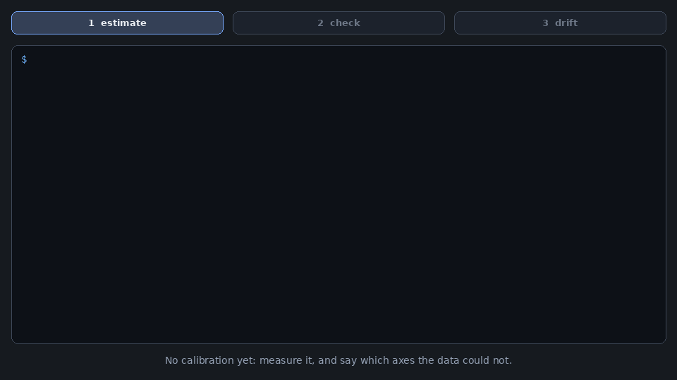
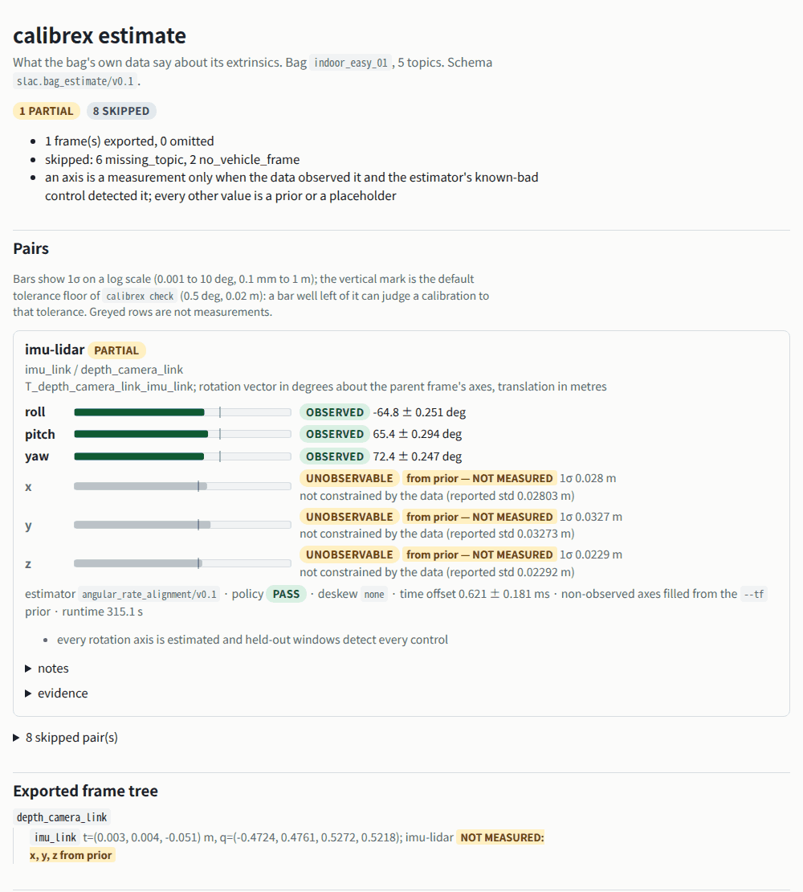

# The workflow: estimate, check, drift

Calibrex answers three questions about the sensor calibration of a robot, one command
each. They chain, and every step reads ROS 2 bags (rosbag2: `.db3` or `.mcap`) with no ROS
installation.

| You have | Ask | Command | You get |
|---|---|---|---|
| a bag and **no calibration yet** | what do the data say the extrinsics are? | [`calibrex estimate`](#1-estimate-no-calibration-yet) | `frames.yaml`, static transforms, URDF joints (and a Kalibr camchain), per-axis std and observability |
| a calibration and **another recording** | is the deployed calibration still right? | [`calibrex check`](#2-check-on-another-recording) | per-axis `pass` / `warn` / `fail` / `inconclusive`, what it could not judge, next steps, progress |
| **several recordings** of one rig over time | did the calibration change, and in which bag? | [`calibrex drift`](#3-drift-over-time) | per-axis `stable` / `drift` / `inconclusive`, the deviating bag, the size of the change |

<p align="center">
  
</p>

<p align="center"><sub>Real runs on the Koide hard-localization recordings
<code>indoor_easy_01</code> and <code>indoor_easy_02</code> (first 130 s each; calibrex 0.5.1). The
output lines are verbatim and abridged; the transcript and the digest of each full output are in
<a href="https://github.com/rsasaki0109/Calibrex/blob/main/docs/assets/calibrex_workflow/transcript.json"><code>transcript.json</code></a>.
The third recording is <code>indoor_easy_01</code> with its IMU rotated 2 deg about z
(<a href="calibrex_drift.md#known-bad-control-a-remounted-imu">known-bad control</a>).</sub></p>

The commands and outputs below are the ones in the recording. A KITTI drive set shows the same
chain for a ground vehicle [further down](#the-same-chain-on-a-ground-vehicle-kitti).

## 0. Install

```bash
python -m pip install "https://github.com/rsasaki0109/Calibrex/releases/download/v0.5.1/calibrex-0.5.1-py3-none-any.whl"
calibrex --help        # the commands are grouped: Start here, Per-pair calibration, Evidence and CI, ...
```

`calibrex --help` lists **Start here** first: `check`, `estimate`, `drift`, `doctor`, `demo`,
`inspect`, `init`, `calibrate` and `render`. The per-pair commands, the evidence and CI tools and
the benchmark helpers follow in their own groups.

## 1. Estimate: no calibration yet

With a bag but no calibration, `calibrex check` has no candidate to judge (every pair reads
`skipped (no_candidate_calibration)`). `calibrex estimate` runs the same native estimators and
keeps what the data observed.

```bash
calibrex estimate indoor_easy_01/ --max-duration-s 130 --output est/ --html est.html
```

```text
imu-lidar (imu_link / depth_camera_link): partial  T_depth_camera_link_imu_link
  roll   -64.8441 deg +- 0.251  observed
  pitch  +65.3548 deg +- 0.294  observed
  yaw    +72.3625 deg +- 0.247  observed
  x      -                      unobservable (not constrained by the data (reported std 0.02803 m))
  y      -                      unobservable (not constrained by the data (reported std 0.03273 m))
  z      -                      unobservable (not constrained by the data (reported std 0.02292 m))
  time offset +0.62 +- 0.18 ms (estimated)
  axes that are not observed hold no measurement and are not exported
...
exported frames (root depth_camera_link):
  depth_camera_link -> imu_link  [imu-lidar] NOT MEASURED x, y, z (from --tf prior)

next steps:
  - verify on a different recording: calibrex check <other bag> --tf est/frames.yaml
  - deploy: est/static_transforms.sh (ROS 2 static_transform_publisher), est/static_transforms.launch.yaml or est/joints.urdf.xml (URDF joints)
  - imu-lidar lever arm z: the motion excites it (9 deg RMS rotation about the other axes) but too briefly: std 1.95 cm against the 1 cm bound. About 6 min of the same motion would reach it (this recording: 2 min). ...
```

What this tells you, and what it will not pretend:

* **Observed vs not measured.** The rotation (roll, pitch, yaw) was observed with a standard
  deviation of about 0.25 deg. The lever arm (x, y, z) was not constrained by this 2-minute
  recording. An axis the data did not observe is **never** written as if it were measured: it is
  written only when a rough `--tf` prior supplies it (the YAML marks it `NOT MEASURED`), otherwise
  the frame is omitted and listed under `next steps`. Here the bag's own `/tf_static` was the prior.
* **Why, and how much motion fixes it.** The last `next steps` line is the translation
  observability hint: the recording rotates enough about the other axes to excite the lever arm, but
  too briefly, and about 6 minutes of the same motion would reach the 1 cm bound. For a recording that
  lacks a rotation axis entirely (a level vehicle) the hint names the missing rotation and says to
  measure it and pass it with `--tf` instead. See [what makes a lever arm
  observable](../concepts/translation_observability.md), which also compares these predictions with
  what happened when more data were recorded.
* **Files.** `est/frames.yaml` (loads directly with `--tf`), `est/static_transforms.sh`,
  `est/static_transforms.launch.yaml`, `est/joints.urdf.xml`, and `est/bag_estimate.json`
  (`slac.bag_estimate/v0.1`, with the bag digest as provenance). `--html est.html` writes one
  offline page:

<p align="center">
  
</p>

<p align="center"><sub>The top of <code>est.html</code>. Observed axes are green bars; the greyed rows
are not measurements. The page also lists the exported files with digests and copy buttons for the
<code>calibrex check --tf</code> and <code>static_transform_publisher</code> commands.</sub></p>

`calibrex render est/bag_estimate.json --format html` regenerates the page later. Rotation-only
estimators (camera-IMU, the vehicle pairs) need a rough lever arm from `--tf`; lidar-lidar starts
from a `--tf` prior; camera-IMU needs the intrinsics (a `CameraInfo` topic or a Kalibr camchain).
Real-data results, with the failures: [`calibrex estimate` on real
data](../benchmarks/estimate_real_data.md).

## 2. Check on another recording

Deploy the estimate (`est/static_transforms.sh`, the launch file or the URDF joints), then verify it
on a **different** recording than the one it was estimated from:

```bash
calibrex check indoor_easy_02/ --tf est/frames.yaml --max-duration-s 130 --pairs imu-lidar --html check.html
```

```text
candidate sources:
  frames_yaml: est/frames.yaml (1 frames) sha256=35eb35a1d7b7
...
pair         sensors                       verdict                                |delta|/tolerance                                           unchecked  detectable
imu-lidar    imu_link / depth_camera_link  pass (partial: roll, pitch, yaw only)  roll 0.255/1.5 deg; pitch 0.982/1.5 deg; yaw 0.484/1.5 deg  x, y, z      roll 1.75 deg; pitch 2.48 deg; yaw 1.98 deg
...
overall verdict: pass
WARNING: 1 pair(s) have partial coverage: unchecked axes were not judged, so a pass covers only the judged axes
```

Read it as: the rotation estimated on recording 1 agrees with recording 2 to within a quarter to
two thirds of the 1.5 deg tolerance (rigid-scan floor), and the data could detect a rotation error of
about 2 deg (`detectable`). The lever arm is **unchecked**, not passed. `check` also prints
the same `next steps` lever-arm hint, shows progress per pair while the estimators run (the
`check:` lines on stderr), and with `--html check.html` writes the per-axis verdict report. The
exit status is non-zero on `fail` (see `--fail-on`), so it gates a pipeline; see
[Calibration CI](calibration_ci.md).

`check` also works without `estimate`: `calibrex check my_bag/` reads the calibration already in the
bag's `/tf_static`, and `--tf` accepts a URDF, a Kalibr camchain or an RTK-SLAM calibration. The full
reference is [Check a deployed calibration](calibrex_check.md); the 3 degree yaw-error demo that
fails and the vendor calibration that passes is the GIF at the top of the
[README](https://github.com/rsasaki0109/Calibrex#readme).

## 3. Drift over time

Over weeks a rig gets serviced, bumped or remounted. Keep one bag per occasion, in recording
order, and ask whether the calibration is the same in all of them. No reference calibration is
needed.

```bash
calibrex drift indoor_easy_01/ indoor_easy_02/ remounted/ --max-duration-s 130 --pairs imu-lidar \
  --output drift/ --html drift.html
```

```text
overall: drift  (a change is flagged beyond max(3 sigma, floor) with chi-square p < 0.01; rotation in deg, translation in cm)

imu-lidar: drift  T_depth_camera_link_imu_link
  axis    indoor_easy_01    indoor_easy_02         remounted   max|diff|  min detectable  status
  roll  -64.844 +- 0.251  -64.821 +- 0.210  -65.717 +- 0.251      0.896           1.500  stable
  pitch +65.355 +- 0.294  +64.647 +- 0.258  +63.962 +- 0.294      1.392           1.500  stable
  yaw   +72.363 +- 0.247  +71.421 +- 0.199  +70.824 +- 0.247      1.539           1.500  drift
  x                    -                 -                 -          -               -  inconclusive
  y                    -                 -                 -          -               -  inconclusive
  z                    -                 -                 -          -               -  inconclusive
  remounted vs the others: roll -0.886 deg, pitch -0.992 deg, yaw -0.968 deg; rotation 1.42 deg
  deviating bag(s): remounted

next steps:
  - imu-lidar: remounted disagrees with the other recording(s); recalibrate it (calibrex estimate remounted --output DIR) or check the mounting, and confirm with calibrex check remounted --tf <the calibration>
```

`remounted/` is a copy of `indoor_easy_01` whose IMU vectors were rotated 2 deg about z
(`tools/rotate_imu_in_bag.py`), which is what a physically remounted IMU measures. `drift` flags
it, names the bag, and reports the change it found: a 1.42 deg rotation against the injected 2 deg
(the rigid-scan estimates carry about 0.25 deg of noise per axis, and the other two recordings agree
with each other to better than 1 deg). Two recordings alone, `indoor_easy_01` and `indoor_easy_02`, read `stable`
with the same table. Read `stable` as "no change larger than `min detectable` was found",
and an axis the data did not observe in two bags is `inconclusive`, not stable. With only two bags a
difference cannot be attributed to one of them, and the output says so. How small a rotation is
detected, and the false-alarm behaviour on unmodified recordings:
[Drift on real data](../benchmarks/drift_real_data.md). Reference: [Detect calibration
drift](calibrex_drift.md).

## The same chain on a ground vehicle (KITTI)

For a ground vehicle the vehicle pairs are opt-in (`--vehicle-frame base_link`). These runs use the
KITTI raw **development** drives converted with `calibrex convert kitti-raw` (the pooled bag is
drives 0005, 0014 and 0022; the held-out drives 0027-0059 were not used) and the OXTS twist as the
wheel proxy.

```bash
K="--vehicle-frame base_link --topic-kind /oxts/twist=wheel"
calibrex estimate kitti_0005_0014_0022/ $K --output est_kitti/ --html est_kitti.html
calibrex check kitti_0009/ --tf est_kitti/frames.yaml $K --html check_0009.html
calibrex drift kitti_0005_0014_0022/ kitti_0009/ kitti_0015/ $K --output drift_kitti/
```

```text
lidar-vehicle (velo_link / base_link): partial  T_base_link_velo_link
  roll   -                      unobservable (not constrained by the data (reported std 0.5074 deg))
  pitch  +0.5254 deg +- 0.0515  observed
  yaw    -0.3127 deg +- 0.0939  observed
exported frames (root base_link):
  base_link -> velo_link  [lidar-vehicle] NOT MEASURED roll, x, y, z (from --tf prior)
  velo_link -> imu_link  [ins-lidar] NOT MEASURED yaw, x, y, z (from --tf prior)
imu-vehicle (imu_link / base_link): failed
  no_judgeable_axes: no axis was constrained by the data: roll unobservable (reported std 0.574 deg); ...
```

Abridged and re-spaced:

```text
pair                  verdict                   |delta|/tolerance    unchecked
lidar-vehicle         pass (partial: yaw only)  yaw 0.0917/0.5 deg   roll, pitch
imu-vehicle           inconclusive              -                    roll, pitch, yaw
ins-lidar             inconclusive              -                    roll, pitch, yaw, x, y, z
lidar-wheel_odometry  pass (partial: yaw only)  yaw 0.095/0.5 deg    roll, pitch
overall verdict: inconclusive
```

```text
lidar-wheel_odometry: stable  T_base_link_velo_link
  axis            kpool3             k0009             k0015   max|diff|  min detectable  status
  roll                 -                 -                 -          -               -  inconclusive
  pitch  +0.525 +- 0.052                 -                 -          -               -  inconclusive
  yaw    -0.304 +- 0.091   -0.215 +- 0.040   -0.258 +- 0.049      0.089           0.500  stable
overall: inconclusive
```

A short drive observes one or two axes of a vehicle pair, so most of the table is
`inconclusive` or "yaw only" and the overall verdict says so instead of passing. That is the
intended behaviour; more or longer drives, with turns, observe more axes. These are development-drive
tool runs, not a held-out claim; the pre-registered KITTI result is on the [KITTI LiDAR-vehicle
page](../benchmarks/kitti_lidar_vehicle.md).

## In the browser

Nothing to install: the **[bag check page](../app/check.html)** runs `calibrex check` and
`calibrex estimate` on your own rosbag2 under [Pyodide](https://pyodide.org), with the same code as the
command line. Drop the bag's `metadata.yaml` and storage file (multi-GB bags are read in place, not
copied or uploaded), pick the pairs and a duration cap, and either **plan** (which pairs can be
checked and why others are skipped), **check** (verdicts, the same report as `--html`) or
**estimate** (download `frames.yaml` and the exports). Each result lists the equivalent CLI
command. Browser runs are about twice as slow as native and read only the first part of the bag;
the details and limits are in [Plan and run a bag in the
browser](calibrex_check.md#plan-and-run-a-bag-in-the-browser). The [browser calibration
page](browser_calibration.md) is the separate, smaller tool that calibrates an IMU against a
trajectory you already have.

## Where to go next

| Question | Page |
|---|---|
| Every option of `check`, the verdicts, the cache, real-data results | [Check a deployed calibration](calibrex_check.md) |
| Why is this axis unobservable, how much motion fixes it | [Translation observability](../concepts/translation_observability.md) |
| Detection limits and false alarms of `drift` | [Drift on real data](../benchmarks/drift_real_data.md) |
| How good are the estimates against Kalibr, KITTI and other references | [`estimate` on real data](../benchmarks/estimate_real_data.md), [SOTA leaderboard](../benchmarks/sota_leaderboard.md) |
| Gate a pipeline on the verdict | [Calibration CI](calibration_ci.md) |
| Your own bag, step by step | [Calibrate your own data](your_own_data.md) |

## What the runs cost

The recording above ran on a laptop CPU with a cold estimator cache: `estimate` of the 130 s Koide
bag took 5 min 19 s, `check` of the second bag 5 min 2 s (it estimates that bag, then judges), and
`drift` over three bags 4 min 46 s (the first two came from the cache; only `remounted` was new).
`--cache-dir` is shared by all three commands, so a re-run, or a `check` of a bag that `drift`
already estimated, costs seconds. The KITTI estimate over the 1268-sweep pooled bag took 5 min 27 s
and the `check` of drive 0009 1 min 52 s.
